# Documento de Requisitos do Produto (PRD) - FocuSprint

## 📋 **RESUMO EXECUTIVO**

### **🎯 Visão do Produto**

FocuSprint é uma plataforma SaaS de gestão de projetos que **unifica Kanban, Chat e Videochamadas** em uma única interface, eliminando a necessidade de alternar entre múltiplas ferramentas.

### **💡 Proposta de Valor Única**

- **Interface 70/30**: Kanban (70%) + Chat (30%) na mesma tela
- **Google Meet integrado**: Videochamadas sem sair do contexto do projeto
- **Referências cruzadas**: Tarefas e conversas conectadas (#123)
- **Tempo real**: Sincronização instantânea entre todos os usuários

### **🏗️ Arquitetura de Duas Camadas**

1. **Platform Admin**: Gestão de clientes, licenças e métricas (admin.focusprint.com)
2. **Client Dashboard**: Interface principal para equipes (app.focusprint.com)

### **💰 Modelo de Negócio**

- **Free**: 5 usuários, 3 projetos, funcionalidades básicas
- **Pro**: R$97/mês (15 usuários), Google Meet incluído
- **Business**: R$399/mês (50 usuários), recursos avançados
- **Target**: PMEs brasileiras (50-200 funcionários)

### **⏰ Cronograma MVP**

- **5-7 semanas**: MVP funcional com core features (200-280 horas)
- **Stack**: Next.js + Supabase + Vercel + Stripe
- **Validação**: Interface unificada reduz 40% do tempo perdido

### **📊 Métricas de Sucesso**

- **Adoção**: Time to First Value < 15min
- **Engajamento**: Cross-Feature Usage > 70%
- **Conversão**: Free → Pro > 5%
- **Retenção**: Monthly Churn < 5%

---

## 1. Visão Geral do Produto

### 1.1 Descrição

O FocuSprint é uma aplicação web de gestão de projetos que integra um quadro Kanban, chat em tempo real e funcionalidade de videochamada em uma única interface. O objetivo principal é proporcionar um ambiente colaborativo onde times possam gerenciar tarefas e comunicar-se eficientemente sem precisar alternar entre diferentes ferramentas.

### 1.2 Proposta de Valor

O diferencial do FocuSprint está na sua interface unificada que mantém o Kanban e o chat sempre visíveis simultaneamente, permitindo que os usuários discutam tarefas enquanto visualizam o fluxo de trabalho. A adição de videochamadas facilita reuniões rápidas para resolver bloqueios ou discutir detalhes do projeto.

### 1.3 Público-Alvo

- Times de desenvolvimento de software
- Times de marketing e design
- Gestores de projeto
- Freelancers que gerenciam múltiplos projetos com clientes
- Pequenas e médias empresas

## 2. Arquitetura do Sistema e Separação de Camadas

### 2.1 Visão Geral da Arquitetura

O FocuSprint é estruturado em **duas camadas distintas e isoladas**:

#### **Camada A: Painel de Administração do SaaS (Platform Admin)**

- **Propósito**: Interface exclusiva para proprietários e administradores da empresa FocuSprint
- **Usuários**: Equipe interna da FocuSprint (founders, desenvolvedores, suporte, financeiro)
- **Acesso**: Restrito por autenticação especial e permissões de super-admin
- **Funcionalidade**: Gestão completa da plataforma, clientes, faturamento e operações

#### **Camada B: Interface do Cliente Final (Client Dashboard)**

- **Propósito**: Interface para clientes que compraram licenças do FocuSprint
- **Usuários**: Clientes finais e seus usuários (empresas, organizações, profissionais)
- **Acesso**: Baseado em licenças ativas e permissões por cliente
- **Funcionalidade**: Uso das funcionalidades do produto (Kanban, Chat, Videochamadas, etc.)

### 2.2 Modelo de Negócio e Conceitos Fundamentais

#### **Hierarquia do Sistema:**

```
FocuSprint Platform (Proprietários)
├── Platform Admins (Equipe FocuSprint)
└── Clients (Clientes que compram licenças)
    ├── Client Admins (Administradores do cliente)
    ├── Users (Usuários do cliente)
    └── Teams (Times criados pelo cliente)
        ├── Team Members (Membros dos times)
        └── Projects (Projetos dos times)
            └── External Collaborators (Colaboradores externos)
```

#### **Definições:**

- **Platform Admins**: Equipe da FocuSprint com acesso total ao sistema
- **Clients**: Entidades que compram licenças (empresas, organizações, profissionais)
- **Client Admins**: Administradores designados pelo cliente para gerenciar sua conta
- **Users**: Pessoas cadastradas pelo cliente para usar o sistema
- **Teams**: Grupos de usuários organizados pelo cliente
- **External Collaborators**: Usuários externos convidados para projetos específicos

### 2.3 Análise de Mercado e Posicionamento

#### 2.3.1 Análise Competitiva

| Concorrente        | Preço/Usuário    | Pontos Fortes               | Limitações                            |
| ------------------ | ---------------- | --------------------------- | ------------------------------------- |
| **Trello**         | $5-10/usuário    | Simplicidade, Kanban        | Sem chat integrado, limitado          |
| **Asana**          | $10-24/usuário   | Recursos avançados          | Complexo, sem chat real-time          |
| **Monday.com**     | $8-16/usuário    | Customização                | Interface confusa, caro               |
| **Slack + Trello** | $15-25/usuário   | Chat + Kanban               | Duas ferramentas, integração limitada |
| **FocuSprint**     | R$19-133/usuário | **Kanban + Chat unificado** | **Novo no mercado**                   |

#### 2.3.2 Proposta de Valor Quantificada

- **Redução de 40%** no tempo gasto alternando entre ferramentas
- **Aumento de 25%** na velocidade de resolução de tarefas
- **Economia de R$200-500/mês** vs usar múltiplas ferramentas
- **ROI de 300%** em 6 meses para equipes de 10+ pessoas

#### 2.3.3 Justificativa de Pricing

**Benchmark de Mercado (por usuário/mês):**

- **Ferramentas Básicas**: $5-10 (Trello, Basecamp)
- **Ferramentas Avançadas**: $10-25 (Asana, Monday)
- **Suítes Completas**: $15-30 (Microsoft Project, Smartsheet)

**FocuSprint Positioning:**

- **Pro (R$97/5 usuários = R$19/usuário)**: 50% mais barato que concorrentes
- **Business (R$399/30 usuários = R$13/usuário)**: 60% mais barato que concorrentes
- **Valor agregado**: Chat integrado + IA + WhatsApp (únicos no mercado)

### 2.4 Planos de Licenciamento para Clientes

#### 2.4.1 Plano Free

- **Preço**: Gratuito
- **Público**: Clientes que querem testar a plataforma
- **Limitações**:
  - 1 time por cliente
  - Até 3 projetos
  - Até 5 usuários
  - Armazenamento: 100MB
  - Videochamadas: 20 minutos por sessão
  - Marca FocuSprint visível
  - Suporte via comunidade
  - Sem acesso a relatórios avançados

#### 2.4.2 Plano Pro

- **Preço**: R$97/mês por cliente
- **Trial**: 14 dias gratuitos com acesso completo
- **Público**: Pequenas empresas e profissionais
- **Recursos**:
  - Até 3 times por cliente
  - Até 10 projetos
  - Até 15 usuários
  - Armazenamento: 5GB
  - Videochamadas ilimitadas
  - Kanban avançado
  - Chat com menções e referências
  - Relatórios básicos
  - Integrações Google/Microsoft
  - Backups semanais
  - Histórico: 6 meses
  - Suporte email (24h)

#### 2.4.3 Plano Business

- **Preço**: R$399/mês por cliente
- **Trial**: 14 dias gratuitos com acesso completo
- **Público**: Empresas médias e departamentos
- **Recursos do Pro, mais**:
  - Até 10 times por cliente
  - Até 50 projetos
  - Até 50 usuários
  - Armazenamento: 20GB
  - API completa e webhooks
  - White-label (sem marca FocuSprint)
  - Relatórios personalizáveis
  - Backups diários
  - Histórico: 1 ano
  - Suporte prioritário (8h)

#### 2.4.4 Plano Enterprise

- **Preço**: Personalizado por cliente
- **Público**: Grandes corporações
- **Recursos do Business, mais**:
  - Times, projetos e usuários ilimitados
  - Armazenamento personalizado
  - SSO, SAML, 2FA obrigatório
  - Conformidade regulatória
  - Ambiente isolado opcional
  - Suporte 24/7 dedicado
  - SLA até 99.99%
  - Recursos personalizados

### 2.4 Tabela Comparativa de Recursos

| Recurso           | Free       | Pro              | Business         | Enterprise     |
| ----------------- | ---------- | ---------------- | ---------------- | -------------- |
| **Preço**         | Gratuito   | R$97/mês         | R$399/mês        | Personalizado  |
| **Times**         | 1          | 3                | 10               | Ilimitados     |
| **Projetos**      | 3          | 10               | 50               | Ilimitados     |
| **Usuários**      | 5          | 15               | 50               | Ilimitados     |
| **Armazenamento** | 100MB      | 5GB              | 20GB             | Personalizado  |
| **Videochamadas** | 20 min     | Ilimitadas       | Ilimitadas       | Ilimitadas     |
| **Kanban**        | Básico     | Avançado         | Completo         | Personalizado  |
| **Chat**          | Básico     | Avançado         | Completo         | Personalizado  |
| **Relatórios**    | Não        | Básicos          | Personalizáveis  | Personalizados |
| **Integrações**   | Não        | Google/Microsoft | API Completa     | Personalizadas |
| **Suporte**       | Comunidade | Email (24h)      | Prioritário (8h) | 24/7 Dedicado  |
| **SLA**           | Não        | 99.5%            | 99.9%            | Até 99.99%     |
| **White-label**   | Não        | Não              | Sim              | Sim            |

### 2.5 Estratégia de Go-to-Market

#### 2.5.1 Segmentação de Mercado

**Mercado Primário (70% do foco):**

- **PMEs Brasileiras**: 50-200 funcionários
- **Setores**: Tecnologia, Marketing, Consultoria, Agências
- **Dor**: Ferramentas fragmentadas, comunicação dispersa
- **Budget**: R$100-500/mês para ferramentas de produtividade

**Mercado Secundário (30% do foco):**

- **Freelancers e Pequenos Times**: 5-15 pessoas
- **Departamentos de Grandes Empresas**: Times específicos
- **Startups**: Crescimento rápido, necessidade de organização

#### 2.5.2 Estratégia de Aquisição

**Canais de Aquisição:**

1. **Content Marketing**: Blog sobre produtividade e gestão
2. **SEO**: "gestão de projetos", "kanban chat", "ferramenta brasileira"
3. **Parcerias**: Integradores, consultores, agências
4. **Freemium**: Conversão orgânica Free → Pro
5. **Indicações**: Programa de referral com incentivos

**Métricas de Aquisição:**

- **CAC Target**: R$150 (Pro), R$800 (Business)
- **LTV Target**: R$2.000 (Pro), R$8.000 (Business)
- **Payback Period**: 6 meses (Pro), 12 meses (Business)

#### 2.5.3 Estratégia de Retenção

**Fatores de Stickiness:**

- **Dados**: Histórico de projetos e conversas
- **Integrações**: Conectado com Google/Microsoft
- **Hábito**: Interface unificada cria dependência
- **Network Effect**: Toda equipe usando a ferramenta

**Programas de Retenção:**

- **Onboarding**: Tutorial interativo obrigatório
- **Success Management**: Acompanhamento primeiros 90 dias
- **Feature Adoption**: Incentivos para usar novas funcionalidades
- **Health Score**: Monitoramento de uso e intervenção proativa

### 2.6 Projeções Financeiras

#### 2.6.1 Modelo de Receita (5 anos)

| Ano       | Clientes Free | Clientes Pro | Clientes Business | MRR       | ARR    |
| --------- | ------------- | ------------ | ----------------- | --------- | ------ |
| **Ano 1** | 1.000         | 50           | 10                | R$8.840   | R$106k |
| **Ano 2** | 5.000         | 200          | 50                | R$39.400  | R$473k |
| **Ano 3** | 15.000        | 500          | 150               | R$108.350 | R$1.3M |
| **Ano 4** | 30.000        | 1.000        | 300               | R$216.700 | R$2.6M |
| **Ano 5** | 50.000        | 2.000        | 600               | R$433.400 | R$5.2M |

#### 2.6.2 Métricas de Negócio

**Conversão Esperada:**

- **Free → Pro**: 5% (benchmark: 2-10%)
- **Pro → Business**: 15% (benchmark: 10-20%)
- **Churn Mensal**: 5% (Pro), 3% (Business)

**Unit Economics:**

- **ARPU Pro**: R$97/mês
- **ARPU Business**: R$399/mês
- **Gross Margin**: 85% (SaaS típico: 80-90%)

### 2.7 Análise de Riscos e Mitigações

#### 2.7.1 Riscos de Mercado

| Risco                                       | Probabilidade | Impacto | Mitigação                         |
| ------------------------------------------- | ------------- | ------- | --------------------------------- |
| **Concorrentes copiam interface unificada** | Alta          | Médio   | Acelerar roadmap IA + WhatsApp    |
| **Mercado não adota ferramenta brasileira** | Média         | Alto    | Foco em diferenciais únicos       |
| **Saturação do mercado de gestão**          | Baixa         | Alto    | Nichos específicos (IA, WhatsApp) |
| **Mudanças no comportamento pós-pandemia**  | Média         | Médio   | Adaptação para trabalho híbrido   |

#### 2.7.2 Riscos Técnicos

| Risco                               | Probabilidade | Impacto    | Mitigação                             |
| ----------------------------------- | ------------- | ---------- | ------------------------------------- |
| **Problemas de escalabilidade**     | Média         | Alto       | Arquitetura cloud-native desde início |
| **Integração complexa Kanban+Chat** | Baixa         | Alto       | Prototipagem e testes extensivos      |
| **Dependência de APIs externas**    | Alta          | Médio      | Fallbacks e alternativas              |
| **Segurança e vazamento de dados**  | Baixa         | Muito Alto | Auditoria contínua, compliance        |

#### 2.7.3 Riscos de Negócio

| Risco                              | Probabilidade | Impacto | Mitigação                            |
| ---------------------------------- | ------------- | ------- | ------------------------------------ |
| **Baixa conversão Free → Pro**     | Média         | Alto    | Onboarding otimizado, limites claros |
| **Alto churn nos primeiros meses** | Média         | Alto    | Customer Success proativo            |
| **Dificuldade de aquisição**       | Alta          | Médio   | Múltiplos canais, parcerias          |
| **Pricing inadequado**             | Média         | Médio   | Testes A/B, feedback contínuo        |

#### 2.7.4 Validação de Mercado Necessária

**Antes do MVP:**

- [ ] **Pesquisa com 100+ PMEs** sobre dores atuais
- [ ] **Entrevistas com 20+ gestores** sobre willingness to pay
- [ ] **Análise de 10+ concorrentes** diretos e indiretos
- [ ] **Teste de conceito** com protótipo navegável

**Durante o MVP:**

- [ ] **Beta com 50+ empresas** reais
- [ ] **Métricas de engajamento** (DAU, WAU, MAU)
- [ ] **Net Promoter Score** > 50
- [ ] **Conversão Free → Pro** > 3%

### 2.8 Métricas de Sucesso do Produto

#### 2.8.1 Métricas de Adoção (MVP)

**Objetivo**: Validar product-market fit

| Métrica                   | Target MVP      | Método de Medição                 |
| ------------------------- | --------------- | --------------------------------- |
| **Time to First Value**   | < 15 min        | Tempo até primeira tarefa criada  |
| **Feature Adoption Rate** | > 80%           | % usuários que usam Kanban+Chat   |
| **Daily Active Users**    | > 60%           | % usuários ativos diariamente     |
| **Session Duration**      | > 20 min        | Tempo médio por sessão            |
| **Task Creation Rate**    | > 5/dia/usuário | Tarefas criadas por usuário ativo |

#### 2.8.2 Métricas de Engajamento

**Objetivo**: Medir stickiness da interface unificada

| Métrica                    | Target     | Justificativa                   |
| -------------------------- | ---------- | ------------------------------- |
| **Chat ↔ Task References** | > 30%      | Uso da integração principal     |
| **Cross-Feature Usage**    | > 70%      | Usuários que usam Kanban E Chat |
| **Return Rate (D7)**       | > 40%      | Usuários voltam após 1 semana   |
| **Feature Switching**      | < 5/sessão | Menos alternância = melhor UX   |

#### 2.8.3 Métricas de Conversão

**Objetivo**: Validar modelo de negócio

| Métrica                   | Target | Prazo    |
| ------------------------- | ------ | -------- |
| **Free → Pro Conversion** | > 5%   | 30 dias  |
| **Trial → Paid**          | > 15%  | 14 dias  |
| **Monthly Churn**         | < 5%   | Contínuo |
| **Net Revenue Retention** | > 100% | Anual    |

#### 2.8.4 Métricas de Qualidade

**Objetivo**: Garantir experiência superior

| Métrica                  | Target  | SLA           |
| ------------------------ | ------- | ------------- |
| **Page Load Time**       | < 3s    | 95% das vezes |
| **Chat Message Latency** | < 500ms | 99% das vezes |
| **Uptime**               | > 99.5% | Mensal        |
| **Error Rate**           | < 1%    | Semanal       |

### 2.9 Gestão de Licenças

- **Ativação**: Automática após registro (trial para planos pagos)
- **Trial**: 14 dias com acesso completo para Pro/Business
- **Cobrança**: Automática após trial, com notificação prévia
- **Renovação**: Automática com notificações prévias
- **Upgrades**: Imediatos com cobrança proporcional
- **Downgrades**: Efetivos no próximo ciclo
- **Cancelamento**: Com período de carência de 30 dias
- **Verificação**: JWT com claims específicos, verificação a cada 24h

### 2.10 Impacto do Trial no Modelo de Negócio

**Vantagens do Trial First:**

- **Menor Fricção**: Usuário experimenta antes de pagar
- **Maior Conversão**: Experiência completa aumenta conversão trial → pago
- **Validação de Valor**: Cliente percebe valor antes do compromisso financeiro
- **Redução de Churn**: Clientes que pagam após trial têm maior retenção

**Métricas de Acompanhamento:**

- **Trial Conversion Rate**: Meta > 15% (trial → pago)
- **Trial Engagement**: Uso durante trial vs pós-conversão
- **Time to Value**: Tempo até primeira ação significativa no trial
- **Trial Churn**: % que cancela antes do fim do trial

## 3. CAMADA A: Painel de Administração do SaaS (Platform Admin)

### 3.1 Visão Geral da Camada Platform Admin

Esta camada é **exclusiva para a equipe da FocuSprint** e permite o controle total da plataforma, clientes, faturamento e operações.

### 3.2 Autenticação e Controle de Acesso

#### 3.2.1 Sistema de Autenticação Especial

- **Autenticação Multi-Fator Obrigatória**: 2FA para todos os platform admins
- **Domínio Restrito**: Apenas emails @focusprint.com podem acessar
- **Sessões Seguras**: Timeout automático após 30 minutos de inatividade
- **Auditoria Completa**: Log de todos os acessos e ações realizadas

#### 3.2.2 Níveis de Permissão Platform Admin

- **Super Admin**: Acesso total (founders)
- **Operations Admin**: Gestão de clientes e suporte
- **Financial Admin**: Faturamento e relatórios financeiros
- **Technical Admin**: Configurações técnicas e manutenção
- **Support Admin**: Apenas visualização e suporte ao cliente

### 3.3 Gestão Completa de Clientes

#### 3.3.1 CRUD de Clientes

- **Criar Cliente**: Registro manual de novos clientes
- **Visualizar Cliente**: Perfil completo com histórico e métricas
- **Editar Cliente**: Informações, planos, configurações
- **Suspender/Reativar**: Controle de status da conta
- **Excluir Cliente**: Processo controlado com backup de dados

#### 3.3.2 Informações Detalhadas do Cliente

- Dados da empresa (nome, CNPJ, endereço, contatos)
- Histórico de licenças e upgrades/downgrades
- Métricas de uso (usuários ativos, projetos, armazenamento)
- Status de pagamentos e faturamento
- Tickets de suporte e interações
- Logs de atividade e auditoria

#### 3.3.3 Gestão de Usuários por Cliente

- Visualizar todos os usuários de um cliente
- Forçar reset de senha ou suspender usuários
- Transferir usuários entre clientes
- Visualizar atividade e último acesso
- Gerenciar permissões especiais

### 3.4 Administração de Faturamento e Cobrança

#### 3.4.1 Integração com Stripe

- **Dashboard Financeiro**: Visão consolidada de toda receita
- **Gestão de Assinaturas**: Criar, modificar, cancelar assinaturas
- **Processamento de Pagamentos**: Monitorar transações e falhas
- **Webhooks**: Receber e processar eventos do Stripe
- **Reconciliação**: Comparar dados Stripe vs sistema interno

#### 3.4.2 Relatórios Financeiros

- **MRR (Monthly Recurring Revenue)**: Por plano e total
- **Churn Rate**: Taxa de cancelamento por período
- **LTV (Lifetime Value)**: Valor médio por cliente
- **CAC (Customer Acquisition Cost)**: Custo de aquisição
- **Previsões**: Projeções de receita e crescimento
- **Exportação**: Relatórios em Excel/PDF para contabilidade

#### 3.4.3 Gestão de Cobrança

- **Faturas**: Visualizar, reenviar, cancelar faturas
- **Inadimplência**: Clientes com pagamentos em atraso
- **Descontos**: Aplicar cupons e promoções
- **Reembolsos**: Processar devoluções quando necessário
- **Histórico**: Completo de todas as transações

### 3.5 Gestão de Planos e Licenças

#### 3.5.1 Administração de Planos

- **CRUD de Planos**: Criar, editar, desativar planos
- **Versionamento**: Manter versões antigas para clientes existentes
- **Promoções**: Criar planos promocionais temporários
- **Limites**: Configurar recursos por plano (usuários, projetos, storage)
- **Preços**: Gerenciar preços por região/moeda

#### 3.5.2 Controle de Licenças

- **Ativação/Suspensão**: Controle manual de licenças
- **Upgrades/Downgrades**: Forçar mudanças de plano
- **Extensões**: Conceder períodos de teste estendidos
- **Transferências**: Mover licenças entre clientes
- **Auditoria**: Histórico completo de alterações

### 3.6 Métricas de Negócio e Dashboards Executivos

#### 3.6.1 Dashboard Principal

- **KPIs Principais**: MRR, Churn, CAC, LTV em tempo real
- **Crescimento**: Novos clientes, upgrades, expansão
- **Uso da Plataforma**: Usuários ativos, projetos criados, engagement
- **Suporte**: Tickets abertos, tempo de resposta, satisfação
- **Performance**: Uptime, latência, erros do sistema

#### 3.6.2 Análises Avançadas

- **Segmentação**: Análise por plano, região, tamanho do cliente
- **Cohort Analysis**: Retenção e comportamento por coorte
- **Funil de Conversão**: Do trial até pagamento
- **Predição de Churn**: Identificar clientes em risco
- **Oportunidades de Upsell**: Clientes prontos para upgrade

### 3.7 Suporte ao Cliente e Ferramentas de Atendimento

#### 3.7.1 Sistema de Tickets

- **Criação**: Tickets automáticos via email ou formulário
- **Categorização**: Por tipo (técnico, financeiro, comercial)
- **Priorização**: Baseada no plano do cliente e urgência
- **Atribuição**: Para especialistas por área
- **SLA**: Controle de tempo de resposta por plano
- **Histórico**: Completo de interações com o cliente

#### 3.7.2 Ferramentas de Suporte

- **Acesso Remoto**: Visualizar conta do cliente (com permissão)
- **Impersonation**: Fazer login como cliente para debug
- **Logs Detalhados**: Acesso a logs de erro e atividade
- **Base de Conhecimento**: Artigos e soluções internas
- **Escalação**: Processo para casos complexos

### 3.8 Configurações Globais da Plataforma

#### 3.8.1 Configurações Técnicas

- **Manutenção**: Agendar e comunicar manutenções
- **Feature Flags**: Ativar/desativar recursos por cliente
- **Rate Limiting**: Configurar limites de API por plano
- **Monitoramento**: Alertas de performance e erros
- **Backup**: Configurações de backup e retenção

#### 3.8.2 Configurações de Negócio

- **Políticas**: Termos de uso, privacidade, SLA
- **Comunicação**: Templates de email e notificações
- **Integrações**: Configurar APIs externas (Stripe, Google, etc.)
- **Segurança**: Políticas de senha, 2FA, sessões
- **Compliance**: Configurações LGPD/GDPR

## 4. CAMADA B: Interface do Cliente Final (Client Dashboard)

### 4.1 Visão Geral da Camada Client Dashboard

Esta camada é **exclusiva para clientes que compraram licenças** e permite o uso completo das funcionalidades do produto.

### 4.2 Autenticação e Controle de Acesso do Cliente

#### 4.2.1 Sistema de Autenticação do Cliente

- **Registro**: Email/senha (método principal) ou login social (Google opcional)
- **Formulário Adaptativo**: Campos essenciais apenas, detalhes podem ser completados posteriormente
- **Tipos de Cliente**: Pessoal, Empresa, Organização, Departamento
- **Escolha de Plano**: Integrada no registro com trial automático para planos pagos
- **Verificação**: Email obrigatória para ativação
- **Recuperação**: Reset de senha via email
- **2FA Opcional**: Para planos Business+ (obrigatório para Enterprise)
- **Sessões**: Timeout baseado no plano da licença

#### 4.2.2 Integração Google OAuth (Opcional)

- **Propósito**: Habilitar funcionalidades Google Meet e Google Calendar
- **Obrigatoriedade**: OPCIONAL - usuários podem usar FocuSprint sem Google
- **Funcionalidades habilitadas**:
  - Criação de Google Meet links no chat
  - Integração com Google Calendar (futuro)
  - Sincronização de eventos (futuro)
- **Campos de database**:
  - `google_account_connected`: BOOLEAN DEFAULT FALSE
  - `google_refresh_token`: TEXT (armazena token para renovação)
- **Fluxo de conexão**:
  1. Usuário clica em "Conectar Google" (opcional)
  2. OAuth flow padrão do Google
  3. Tokens armazenados de forma segura
  4. Funcionalidades Google Meet habilitadas
- **Segurança**: Tokens criptografados, renovação automática

#### 4.2.3 Níveis de Permissão do Cliente

- **Client Owner**: Proprietário da licença (acesso total)
- **Client Admin**: Administrador designado (gestão de usuários e times)
- **Team Leader**: Líder de time específico
- **Team Member**: Membro regular de time
- **External Collaborator**: Usuário externo convidado (acesso limitado)

### 4.3 Dashboard do Cliente e Gestão de Licenças

#### 4.3.1 Dashboard Principal do Cliente

- **Visão Geral**: Status da licença, uso de recursos, atividade recente
- **Métricas**: Projetos ativos, usuários, armazenamento usado
- **Notificações**: Alertas de limite, renovação, atualizações
- **Acesso Rápido**: Projetos favoritos, tarefas pendentes

#### 4.3.2 Gestão da Própria Licença

- **Visualização**: Detalhes do plano atual e limites
- **Upgrade/Downgrade**: Solicitar mudanças de plano
- **Faturamento**: Histórico de pagamentos e próximas cobranças
- **Usuários**: Adicionar/remover usuários dentro do limite
- **Configurações**: Preferências da conta e notificações

### 4.4 Gestão de Usuários e Times do Cliente

#### 4.4.1 Gestão de Usuários

- **Convidar Usuários**: Enviar convites por email dentro do limite da licença
- **Gerenciar Permissões**: Atribuir roles (Admin, Team Leader, Member)
- **Visualizar Atividade**: Último acesso, projetos ativos, tarefas
- **Remover Usuários**: Desativar acesso e transferir responsabilidades
- **Configurar Perfis**: Informações pessoais e preferências

#### 4.4.2 Gestão de Times

- **Criar Times**: Organizar usuários em grupos de trabalho
- **Configurar Times**: Nome, descrição, líder, membros
- **Permissões de Time**: Controlar acesso a projetos e recursos
- **Métricas de Time**: Performance, atividade, colaboração
- **Arquivar Times**: Manter histórico sem ocupar limite ativo

### 4.5 Criação e Gerenciamento de Projetos

#### 4.5.1 CRUD de Projetos

- **Criar Projeto**: Nome, descrição, time responsável, configurações
- **Configurar Projeto**: Colunas Kanban, permissões, integrações
- **Convidar Participantes**: Membros internos e colaboradores externos
- **Gerenciar Acesso**: Controlar quem pode ver/editar o projeto
- **Arquivar/Excluir**: Finalizar projetos mantendo histórico

#### 4.5.2 Configurações de Projeto

- **Layout**: Personalizar divisão Kanban (70%) / Chat (30%)
- **Colunas**: Criar, editar, reordenar colunas do Kanban
- **Templates**: Salvar e aplicar templates de projeto
- **Integrações**: Conectar com Google Drive, Calendar, etc.
- **Notificações**: Configurar alertas por projeto

### 4.6 User Stories e Acceptance Criteria

#### 4.6.1 Epic: Gestão de Projetos Unificada

**US001 - Visualização Unificada Kanban + Chat**

```
Como um gerente de projeto,
Eu quero ver o Kanban (70%) e Chat (30%) na mesma tela,
Para que eu possa gerenciar tarefas e comunicação sem alternar entre ferramentas.

Acceptance Criteria:
- [ ] Interface dividida 70/30 responsiva
- [ ] Kanban funcional com drag & drop
- [ ] Chat em tempo real funcionando
- [ ] Sincronização entre menções no chat e tarefas
- [ ] Performance < 3s para carregar projeto
```

**US002 - Criação Rápida de Tarefas**

```
Como um membro da equipe,
Eu quero criar tarefas rapidamente durante conversas,
Para que eu não perca ideias importantes discutidas no chat.

Acceptance Criteria:
- [ ] Botão "+" visível no chat e kanban
- [ ] Modal de criação com campos essenciais
- [ ] Auto-atribuição para quem cria
- [ ] Notificação automática no chat
- [ ] Criação em < 10 segundos
```

**US003 - Referência Cruzada Chat ↔ Tarefas**

```
Como um usuário,
Eu quero referenciar tarefas no chat (#123) e ver discussões na tarefa,
Para que o contexto seja preservado entre comunicação e execução.

Acceptance Criteria:
- [ ] Sintaxe #123 cria link para tarefa
- [ ] Preview da tarefa no chat
- [ ] Comentários do chat aparecem na tarefa
- [ ] Histórico completo de discussões
- [ ] Busca funciona em ambos os contextos
```

#### 4.6.2 Epic: Colaboração em Tempo Real

**US004 - Videochamadas Integradas**

```
Como um líder de equipe,
Eu quero iniciar videochamadas sem sair do projeto,
Para que discussões importantes aconteçam no contexto certo.

Acceptance Criteria:
- [ ] Botão de videochamada visível
- [ ] Integração com Google Meet
- [ ] Interface sobreposta minimizável
- [ ] Chat continua durante chamada
- [ ] Gravação disponível (Business+)
```

**US005 - Notificações Inteligentes**

```
Como um usuário,
Eu quero receber notificações relevantes sem spam,
Para que eu fique informado sem ser interrompido constantemente.

Acceptance Criteria:
- [ ] Notificações configuráveis por tipo
- [ ] Menções (@user) sempre notificam
- [ ] Prazos próximos alertam automaticamente
- [ ] Modo "não perturbar" disponível
- [ ] Resumo diário opcional
```

#### 4.6.3 Epic: Gestão de Equipe

**US006 - Onboarding Guiado**

```
Como um novo usuário,
Eu quero ser guiado através das funcionalidades principais,
Para que eu consiga usar a ferramenta produtivamente no primeiro dia.

Acceptance Criteria:
- [ ] Tutorial interativo obrigatório
- [ ] Checklist de setup inicial
- [ ] Tooltips contextuais
- [ ] Projeto exemplo pré-criado
- [ ] Conclusão em < 15 minutos
```

**US007 - Minha Semana**

```
Como um usuário,
Eu quero ver todas as minhas tarefas organizadas por dia,
Para que eu possa planejar minha semana de trabalho.

Acceptance Criteria:
- [ ] Visualização por dia da semana
- [ ] Drag & drop entre dias
- [ ] Filtros por projeto/prioridade
- [ ] Indicador de carga de trabalho
- [ ] Acesso rápido para editar tarefas
```

### 4.7 Funcionalidades Principais do Produto

#### 4.7.1 Quadro Kanban (70% da interface)

- **Gestão de Colunas**: Criar, editar, reordenar, excluir colunas
- **Gestão de Tarefas**: Criar, editar, mover, excluir tarefas
- **Drag & Drop**: Arrastar tarefas entre colunas
- **Atribuições**: Designar responsáveis para tarefas
- **Prazos**: Definir e acompanhar deadlines
- **Etiquetas**: Categorizar tarefas com cores e labels
- **Prioridades**: Sistema visual de priorização
- **Anexos**: Upload de arquivos (limite baseado no plano)
- **Comentários**: Discussões em tarefas específicas
- **Checklists**: Subtarefas dentro das tarefas
- **Histórico**: Log de alterações e atividades

#### 4.7.2 Chat em Tempo Real (30% da interface)

- **Mensagens**: Texto em tempo real entre participantes
- **Indicadores**: Digitação, online/offline, lida/não lida
- **Arquivos**: Envio de imagens, documentos, links
- **Menções**: @usuário para notificar pessoas específicas
- **Referências**: #tarefa para referenciar itens do Kanban
- **Histórico**: Busca e navegação em mensagens antigas
- **Threads**: Conversas organizadas (planos Business+)
- **Reações**: Emojis e reações rápidas (planos Business+)
- **Notificações**: Alertas configuráveis por projeto

#### 4.7.3 Videochamadas

- **Iniciar Chamadas**: Com participantes do projeto
- **Controles**: Áudio, vídeo, compartilhamento de tela
- **Interface**: Sobreposta ao layout principal (minimizável)
- **Participantes**: Limite baseado no plano da licença

### 4.8 UX Guidelines e Design System

#### 4.8.1 Princípios de UX

**1. Unified Experience (Experiência Unificada)**

- **Princípio**: Kanban + Chat devem parecer uma única ferramenta
- **Implementação**: Transições suaves, contexto compartilhado
- **Métrica**: < 5 alternâncias entre áreas por sessão

**2. Context Preservation (Preservação de Contexto)**

- **Princípio**: Usuário nunca perde o contexto do que estava fazendo
- **Implementação**: Estado persistente, breadcrumbs claros
- **Métrica**: < 10% de usuários perdidos em navegação

**3. Progressive Disclosure (Revelação Progressiva)**

- **Princípio**: Mostrar apenas o necessário para a tarefa atual
- **Implementação**: Modais, tooltips, expansão gradual
- **Métrica**: > 80% de features descobertas naturalmente

**4. Immediate Feedback (Feedback Imediato)**

- **Princípio**: Toda ação tem resposta visual instantânea
- **Implementação**: Loading states, confirmações, animações
- **Métrica**: < 500ms para feedback visual

#### 4.8.2 Layout e Estrutura

**Interface Principal (70/30):**

```
┌─────────────────────────────────────────────────────────────┐
│ Header: Projeto + Navegação + Usuário                      │
├─────────────────────────────────┬───────────────────────────┤
│                                 │                           │
│         KANBAN BOARD            │         CHAT              │
│            (70%)                │         (30%)             │
│                                 │                           │
│ ┌─────┐ ┌─────┐ ┌─────┐ ┌─────┐ │ ┌─────────────────────────┐ │
│ │ TO  │ │ IN  │ │TEST │ │DONE │ │ │ Mensagens em tempo real │ │
│ │ DO  │ │PROG │ │     │ │     │ │ │                         │ │
│ │     │ │     │ │     │ │     │ │ │ @menções #tarefas       │ │
│ └─────┘ └─────┘ └─────┘ └─────┘ │ │                         │ │
│                                 │ └─────────────────────────┘ │
│                                 │ ┌─────────────────────────┐ │
│                                 │ │ Input de mensagem       │ │
│                                 │ └─────────────────────────┘ │
└─────────────────────────────────┴───────────────────────────┘
```

**Responsividade Mobile:**

- **Desktop**: 70/30 lado a lado
- **Tablet**: 60/40 com chat colapsável
- **Mobile**: Tabs alternáveis (Kanban | Chat)

#### 4.8.3 Design System (shadcn/ui)

**Cores Principais:**

- **Primary**: #10B981 (Verde - ação/sucesso)
- **Secondary**: #6B7280 (Cinza - neutro)
- **Accent**: #3B82F6 (Azul - links/info)
- **Warning**: #F59E0B (Amarelo - atenção)
- **Error**: #EF4444 (Vermelho - erro)

**Tipografia:**

- **Heading**: Inter Bold (24px, 20px, 16px)
- **Body**: Inter Regular (14px, 16px)
- **Caption**: Inter Medium (12px)
- **Code**: JetBrains Mono (14px)

**Componentes Críticos:**

- **TaskCard**: Drag & drop, status visual, assignee
- **ChatMessage**: Avatar, timestamp, reactions
- **Modal**: Overlay, escape key, focus trap
- **Notification**: Toast, position, auto-dismiss

#### 4.8.4 Interações e Microanimações

**Drag & Drop (Kanban):**

- **Hover**: Card elevation + shadow
- **Drag**: Semi-transparent, cursor change
- **Drop Zone**: Visual highlight
- **Success**: Smooth transition + confirmation

**Chat Real-time:**

- **Typing**: Indicator com avatar
- **Message Sent**: Slide in animation
- **Mention**: Highlight + notification sound
- **Reactions**: Bounce animation

**Loading States:**

- **Page Load**: Skeleton screens
- **Action Feedback**: Button spinner
- **Data Fetch**: Progressive loading
- **Error States**: Clear messaging + retry
- **Integração Google Meet**: Para usuários autenticados via Google
- **Gravação**: Disponível para planos Business+ (opcional)
- **Chat durante chamada**: Mensagens paralelas à videochamada

### 4.7 Relatórios e Métricas Específicos do Cliente

#### 4.7.1 Relatórios de Produtividade

- **Por Time**: Performance, tarefas concluídas, tempo médio
- **Por Projeto**: Progresso, marcos, deadlines
- **Por Usuário**: Atividade individual, carga de trabalho
- **Comparativos**: Períodos, times, projetos
- **Exportação**: PDF, Excel, CSV (baseado no plano)

#### 4.7.2 Métricas de Uso

- **Dashboard de Uso**: Recursos utilizados vs limites da licença
- **Tendências**: Crescimento de usuários, projetos, atividade
- **Alertas**: Proximidade de limites, renovação de licença
- **Histórico**: Evolução do uso ao longo do tempo

### 4.8 Configurações de Conta e Perfil do Cliente

#### 4.8.1 Configurações da Conta

- **Informações da Empresa**: Nome, logo, dados de contato
- **Preferências**: Timezone, idioma, formato de data
- **Notificações**: Configurar tipos e frequência de alertas
- **Integrações**: Conectar com serviços externos
- **Segurança**: Políticas de senha, 2FA, sessões

#### 4.8.2 Gestão de Perfis de Usuário

- **Perfil Pessoal**: Foto, nome, cargo, informações de contato
- **Preferências**: Tema (claro/escuro), notificações pessoais
- **Atividade**: Histórico de ações, projetos recentes
- **Configurações**: Privacidade, visibilidade, disponibilidade

### 4.9 Funcionalidades Especiais

#### 4.9.1 Minha Semana

- **Visão Consolidada**: Todas as tarefas do usuário por dia da semana
- **Filtros**: Por projeto, prioridade, status
- **Organização**: Drag & drop para reorganizar por dia
- **Indicadores**: Carga de trabalho, prazos próximos
- **Acesso Rápido**: Editar tarefas diretamente da visualização

#### 4.9.2 Sistema de Notificações do Cliente

- **Tipos**: In-app, email, push (futuro)
- **Eventos**: Menções, atribuições, prazos, atualizações de projeto
- **Configurações**: Granulares por tipo de evento e projeto
- **Centro de Notificações**: Histórico e gerenciamento centralizado

## 5. Arquitetura Técnica e Isolamento de Camadas

### 5.1 Arquitetura de Sistema e Deployment

#### 5.1.1 Arquitetura de Alto Nível

```mermaid
graph TB
    subgraph "🌐 CDN Layer"
        CDN[Vercel Edge Network]
    end

    subgraph "🔀 Load Balancer"
        LB[Vercel Load Balancer]
    end

    subgraph "💻 Application Layer"
        APP1[Next.js Instance 1]
        APP2[Next.js Instance 2]
        APP3[Next.js Instance N]
    end

    subgraph "🗄️ Database Layer"
        DB[(Supabase PostgreSQL)]
        CACHE[(Redis Cache)]
        STORAGE[(Supabase Storage)]
    end

    subgraph "🔧 External Services"
        STRIPE[Stripe Payments]
        GOOGLE[Google APIs]
        CLAUDE[Claude 3 Haiku]
        WHATSAPP[WhatsApp Business]
    end

    subgraph "📊 Monitoring"
        SENTRY[Sentry Error Tracking]
        ANALYTICS[Vercel Analytics]
        LOGS[Vercel Logs]
    end

    CDN --> LB
    LB --> APP1
    LB --> APP2
    LB --> APP3

    APP1 --> DB
    APP2 --> DB
    APP3 --> DB

    APP1 --> CACHE
    APP2 --> CACHE
    APP3 --> CACHE

    APP1 --> STORAGE
    APP2 --> STORAGE
    APP3 --> STORAGE

    APP1 --> STRIPE
    APP1 --> GOOGLE
    APP1 --> CLAUDE
    APP1 --> WHATSAPP

    APP1 --> SENTRY
    APP1 --> ANALYTICS
    APP1 --> LOGS
```



#### 5.1.2 Estratégia de Deployment

**Ambientes:**

```yaml
# Production
Domain: app.focusprint.com, admin.focusprint.com
Infrastructure: Vercel Pro
Database: Supabase Production (Multi-AZ)
Cache: Upstash Redis (Global)
CDN: Vercel Edge Network (Global)

# Staging
Domain: staging-app.focusprint.com, staging-admin.focusprint.com
Infrastructure: Vercel Preview
Database: Supabase Staging
Cache: Upstash Redis (Single Region)

# Development
Domain: localhost:3001
Infrastructure: Local
Database: Supabase Local / Docker
Cache: Local Redis
```

**CI/CD Pipeline:**

```yaml
# .github/workflows/deploy.yml
name: Deploy FocuSprint
on:
  push:
    branches: [main, develop]
  pull_request:
    branches: [main]

jobs:
  test:
    runs-on: ubuntu-latest
    steps:
      - name: Run Tests
        run: |
          npm run test:unit
          npm run test:integration
          npm run test:e2e

  security:
    runs-on: ubuntu-latest
    steps:
      - name: Security Audit
        run: |
          npm audit --audit-level high
          npm run test:security

  deploy-staging:
    if: github.ref == 'refs/heads/develop'
    needs: [test, security]
    runs-on: ubuntu-latest
    steps:
      - name: Deploy to Staging
        run: vercel --prod --token ${{ secrets.VERCEL_TOKEN }}

  deploy-production:
    if: github.ref == 'refs/heads/main'
    needs: [test, security]
    runs-on: ubuntu-latest
    steps:
      - name: Deploy to Production
        run: |
          vercel --prod --token ${{ secrets.VERCEL_TOKEN }}
          npm run post-deploy:health-check
```

#### 5.1.3 Escalabilidade e Performance

**Horizontal Scaling:**

- **Auto-scaling**: Vercel serverless functions (0-1000+ instances)
- **Database**: Supabase connection pooling (PgBouncer)
- **Cache**: Redis cluster para sessões e queries frequentes
- **CDN**: Assets estáticos distribuídos globalmente

**Performance Targets:**

```typescript
// Performance SLAs
const PERFORMANCE_TARGETS = {
  // Page Load
  TTFB: 200, // Time to First Byte (ms)
  FCP: 1000, // First Contentful Paint (ms)
  LCP: 2500, // Largest Contentful Paint (ms)

  // API Response
  DATABASE_QUERY: 100, // Average query time (ms)
  API_RESPONSE: 500, // 95th percentile (ms)
  REALTIME_LATENCY: 100, // Chat message latency (ms)

  // Availability
  UPTIME: 99.9, // Monthly uptime (%)
  ERROR_RATE: 0.1, // Error rate (%)
};
```

### 5.2 Arquitetura Geral do Sistema

#### 5.2.1 Separação Física e Lógica

```mermaid
graph TB
    subgraph "🌐 FocuSprint Platform"
        subgraph "🔧 CAMADA A: Platform Admin"
            A1[admin.focusprint.com]
            A2[Autenticação: @focusprint.com + 2FA]
            A3[Database: platform_admin schema]
            A4[APIs: /admin/api/*]
            A5[Interface: React Admin Dashboard]
        end

        subgraph "👥 CAMADA B: Client Dashboard"
            B1[app.focusprint.com]
            B2[Autenticação: Clientes + licenças]
            B3[Database: client_data schema + RLS]
            B4[APIs: /api/*]
            B5[Interface: Next.js Client App]
        end

        subgraph "🗄️ Shared Infrastructure"
            C1[(Supabase PostgreSQL)]
            C2[Supabase Auth]
            C3[Supabase Realtime]
            C4[Supabase Storage]
        end

        subgraph "💳 External Services"
            D1[Stripe Payments]
            D2[Google Meet API]
            D3[Email Service]
            D4[Claude 3 Haiku]
            D5[WhatsApp Business API]
        end
    end

    A1 --> A2
    A2 --> A3
    A3 --> A4
    A4 --> A5

    B1 --> B2
    B2 --> B3
    B3 --> B4
    B4 --> B5

    A3 --> C1
    B3 --> C1
    A2 --> C2
    B2 --> C2
    B5 --> C3
    B5 --> C4

    A5 --> D1
    A5 --> D3
    B5 --> D1
    B5 --> D2
    B5 --> D3
    B5 --> D4
    B5 --> D5

    style A1 fill:#ff9999
    style B1 fill:#99ccff
    style C1 fill:#99ff99
    style D1 fill:#ffcc99
```



#### 5.2.2 Stack Tecnológico por Camada

**Camada A - Platform Admin:**

- **Frontend**: React Admin + Material-UI
- **Backend**: Next.js API Routes dedicadas (/admin/api/\*)
- **Autenticação**: NextAuth.js com provider customizado
- **Database**: Schema separado (platform_admin)
- **Domínio**: admin.focusprint.com

**Camada B - Client Dashboard:**

- **Frontend**: Next.js + shadcn/ui + Tailwind CSS
- **Backend**: Next.js API Routes (/api/\*)
- **Autenticação**: Supabase Auth
- **Database**: Schema principal (client_data) com RLS
- **Domínio**: app.focusprint.com

### 5.3 Padrões Arquiteturais e Estrutura de Código

#### 5.3.1 Estrutura de Pastas (Next.js App Router)

```
src/
├── app/                              # Next.js 14+ App Router
│   ├── (platform-admin)/             # Route Group - Platform Admin
│   │   ├── admin/
│   │   │   ├── clients/
│   │   │   │   ├── page.tsx           # /admin/clients
│   │   │   │   └── [id]/
│   │   │   │       └── page.tsx       # /admin/clients/[id]
│   │   │   ├── licenses/
│   │   │   ├── metrics/
│   │   │   └── layout.tsx             # Admin Layout
│   │   └── api/
│   │       └── admin/                 # Platform Admin APIs
│   │           ├── clients/
│   │           ├── licenses/
│   │           └── metrics/
│   │   ├── dashboard/
│   │   │   ├── page.tsx               # /dashboard
│   │   │   ├── projects/
│   │   │   │   ├── page.tsx           # /dashboard/projects
│   │   │   │   └── [id]/
│   │   │   │       └── page.tsx       # /dashboard/projects/[id]
│   │   │   ├── teams/
│   │   │   ├── my-week/
│   │   │   └── layout.tsx             # Client Layout
│   │   └── api/                       # Client Dashboard APIs
│   │       ├── projects/
│   │       ├── tasks/
│   │       ├── messages/
│   │       └── users/
│   ├── globals.css                    # Global styles
│   ├── layout.tsx                     # Root layout
│   └── page.tsx                       # Landing page
├── components/                        # Shared components
│   ├── ui/                           # shadcn/ui components
│   │   ├── button.tsx
│   │   ├── input.tsx
│   │   ├── modal.tsx
│   │   └── index.ts                  # Barrel exports
│   ├── forms/                        # Form components
│   │   ├── task-form.tsx
│   │   ├── project-form.tsx
│   │   └── user-invite-form.tsx
│   ├── layout/                       # Layout components
│   │   ├── header.tsx
│   │   ├── sidebar.tsx
│   │   └── footer.tsx
│   ├── kanban/                       # Kanban-specific components
│   │   ├── board.tsx
│   │   ├── column.tsx
│   │   ├── task-card.tsx
│   │   └── drag-overlay.tsx
│   └── chat/                         # Chat-specific components
│       ├── chat-container.tsx
│       ├── message-list.tsx
│       ├── message-input.tsx
│       └── user-list.tsx
├── hooks/                            # Custom React hooks
│   ├── use-auth.ts                   # Authentication hook
│   ├── use-client-data.ts            # Client data hook
│   ├── use-realtime.ts               # Supabase realtime hook
│   ├── use-kanban.ts                 # Kanban state management
│   └── use-chat.ts                   # Chat state management
├── lib/                              # Utilities and configurations
│   ├── supabase/                     # Supabase configuration
│   │   ├── client.ts                 # Supabase client
│   │   ├── server.ts                 # Server-side client
│   │   ├── middleware.ts             # Auth middleware
│   │   └── types.ts                  # Database types
│   ├── auth/                         # Authentication utilities
│   │   ├── config.ts                 # Auth configuration
│   │   ├── providers.ts              # Auth providers
│   │   └── guards.ts                 # Route guards
│   ├── utils/                        # General utilities
│   │   ├── cn.ts                     # Class name utility
│   │   ├── date.ts                   # Date utilities
│   │   ├── validation.ts             # Zod schemas
│   │   └── constants.ts              # App constants
│   └── api/                          # API utilities
│       ├── client.ts                 # API client
│       ├── types.ts                  # API types
│       └── errors.ts                 # Error handling
├── types/                            # TypeScript type definitions
│   ├── database.ts                   # Database types (auto-generated)
│   ├── api.ts                        # API response types
│   ├── auth.ts                       # Authentication types
│   └── global.ts                     # Global types
├── constants/                        # Application constants
│   ├── routes.ts                     # Route constants
│   ├── permissions.ts                # Permission constants
│   ├── plans.ts                      # Plan configurations
│   └── ui.ts                         # UI constants
└── middleware.ts                     # Next.js middleware
```

#### 5.3.2 Padrões de Componentes React

**Component Structure Pattern:**

```typescript
// components/kanban/task-card.tsx
import React from "react";
import { cn } from "@/lib/utils";
import { Button } from "@/components/ui/button";
import { useTaskActions } from "@/hooks/use-task-actions";
import type { Task, User } from "@/types/database";

// 1. Interface Definition
interface TaskCardProps {
  task: Task;
  assignees: User[];
  onEdit?: (task: Task) => void;
  onDelete?: (taskId: string) => void;
  className?: string;
}

// 2. Component Implementation
export const TaskCard: React.FC<TaskCardProps> = ({
  task,
  assignees,
  onEdit,
  onDelete,
  className,
}) => {
  // 3. Hooks (always at the top)
  const { updateTask, deleteTask, loading } = useTaskActions();

  // 4. Event Handlers
  const handleEdit = () => {
    onEdit?.(task);
  };

  const handleDelete = async () => {
    if (confirm("Delete this task?")) {
      await deleteTask(task.id);
      onDelete?.(task.id);
    }
  };

  // 5. Early Returns
  if (!task) return null;

  // 6. Main Render
  return (
    <div
      className={cn(
        "task-card",
        "p-4 bg-white rounded-lg shadow-sm border",
        "hover:shadow-md transition-shadow",
        className
      )}
    >
      <h3 className="font-medium text-sm">{task.title}</h3>
      {task.description && (
        <p className="text-xs text-gray-600 mt-1">{task.description}</p>
      )}

      <div className="flex items-center justify-between mt-3">
        <div className="flex -space-x-1">
          {assignees.map((user) => (
            
          ))}
        </div>

        <div className="flex gap-1">
          <Button
            size="sm"
            variant="ghost"
            onClick={handleEdit}
            disabled={loading}
          >
            Edit
          </Button>
          <Button
            size="sm"
            variant="ghost"
            onClick={handleDelete}
            disabled={loading}
          >
            Delete
          </Button>
        </div>
      </div>
    </div>
  );
};

// 7. Default Export
export default TaskCard;
```

#### 5.3.3 Padrões de Custom Hooks

**Hook Structure Pattern:**

```typescript
// hooks/use-kanban.ts
import { useState, useEffect, useCallback } from "react";
import { useSupabase } from "@/lib/supabase/client";
import type { Project, Column, Task } from "@/types/database";

interface UseKanbanReturn {
  // State
  columns: Column[];
  tasks: Task[];
  loading: boolean;
  error: string | null;

  // Actions
  actions: {
    createTask: (columnId: string, task: Partial<Task>) => Promise<void>;
    updateTask: (taskId: string, updates: Partial<Task>) => Promise<void>;
    moveTask: (taskId: string, targetColumnId: string) => Promise<void>;
    deleteTask: (taskId: string) => Promise<void>;
    reorderTasks: (columnId: string, taskIds: string[]) => Promise<void>;
  };
}

export const useKanban = (projectId: string): UseKanbanReturn => {
  // State
  const [columns, setColumns] = useState<Column[]>([]);
  const [tasks, setTasks] = useState<Task[]>([]);
  const [loading, setLoading] = useState(true);
  const [error, setError] = useState<string | null>(null);

  const supabase = useSupabase();

  // Load initial data
  useEffect(() => {
    loadKanbanData();
  }, [projectId]);

  // Actions
  const createTask = useCallback(
    async (columnId: string, task: Partial<Task>) => {
      try {
        setLoading(true);
        const { data, error } = await supabase
          .from("tasks")
          .insert({ ...task, column_id: columnId, project_id: projectId })
          .select()
          .single();

        if (error) throw error;
        setTasks((prev) => [...prev, data]);
      } catch (err) {
        setError(err.message);
      } finally {
        setLoading(false);
      }
    },
    [projectId, supabase]
  );

  // ... other actions

  return {
    columns,
    tasks,
    loading,
    error,
    actions: {
      createTask,
      updateTask,
      moveTask,
      deleteTask,
      reorderTasks,
    },
  };
};
```

#### 5.3.4 Padrões de API Routes

**API Route Structure Pattern:**

```typescript
// app/api/projects/[id]/tasks/route.ts
import { NextRequest, NextResponse } from "next/server";
import { createRouteHandlerClient } from "@supabase/auth-helpers-nextjs";
import { cookies } from "next/headers";
import { z } from "zod";

// 1. Validation Schemas
const CreateTaskSchema = z.object({
  title: z.string().min(1).max(255),
  description: z.string().optional(),
  column_id: z.string().uuid(),
  priority: z.enum(["low", "medium", "high", "urgent"]).default("medium"),
  due_date: z.string().datetime().optional(),
  assigned_to: z.array(z.string().uuid()).optional(),
});

// 2. GET Handler
export async function GET(
  request: NextRequest,
  { params }: { params: { id: string } }
) {
  try {
    const supabase = createRouteHandlerClient({ cookies });

    // Authentication check
    const {
      data: { user },
      error: authError,
    } = await supabase.auth.getUser();
    if (authError || !user) {
      return NextResponse.json({ error: "Unauthorized" }, { status: 401 });
    }

    // Permission check
    const { data: project } = await supabase
      .from("projects")
      .select("id")
      .eq("id", params.id)
      .single();

    if (!project) {
      return NextResponse.json({ error: "Project not found" }, { status: 404 });
    }

    // Fetch tasks
    const { data: tasks, error } = await supabase
      .from("tasks")
      .select(
        `
        *,
        assignees:task_assignments(
          user:auth.users(id, email, user_metadata)
        ),
        comments:comments(count)
      `
      )
      .eq("project_id", params.id)
      .order("position");

    if (error) throw error;

    return NextResponse.json({ tasks });
  } catch (error) {
    console.error("GET /api/projects/[id]/tasks:", error);
    return NextResponse.json(
      { error: "Internal server error" },
      { status: 500 }
    );
  }
}

// 3. POST Handler
export async function POST(
  request: NextRequest,
  { params }: { params: { id: string } }
) {
  try {
    const body = await request.json();
    const validatedData = CreateTaskSchema.parse(body);

    const supabase = createRouteHandlerClient({ cookies });

    // Authentication & permission checks...

    const { data: task, error } = await supabase
      .from("tasks")
      .insert({
        ...validatedData,
        project_id: params.id,
        created_by: user.id,
      })
      .select()
      .single();

    if (error) throw error;

    return NextResponse.json({ task }, { status: 201 });
  } catch (error) {
    if (error instanceof z.ZodError) {
      return NextResponse.json(
        { error: "Validation error", details: error.errors },
        { status: 400 }
      );
    }

    console.error("POST /api/projects/[id]/tasks:", error);
    return NextResponse.json(
      { error: "Internal server error" },
      { status: 500 }
    );
  }
}
```

### 5.4 Arquitetura de Segurança e Compliance

#### 5.4.1 Camadas de Segurança

```mermaid
graph TB
    subgraph "🌐 Network Security"
        WAF[Web Application Firewall]
        DDoS[DDoS Protection]
        SSL[SSL/TLS Encryption]
    end

    subgraph "🔐 Application Security"
        AUTH[Authentication Layer]
        AUTHZ[Authorization Layer]
        VALIDATION[Input Validation]
        SANITIZATION[Data Sanitization]
    end

    subgraph "🗄️ Data Security"
        ENCRYPTION[Data Encryption at Rest]
        RLS[Row Level Security]
        BACKUP[Encrypted Backups]
        AUDIT[Audit Logging]
    end

    subgraph "🔍 Monitoring & Compliance"
        SIEM[Security Monitoring]
        GDPR[GDPR Compliance]
        LGPD[LGPD Compliance]
        SOC[SOC 2 Controls]
    end

    WAF --> AUTH
    DDoS --> AUTH
    SSL --> AUTH

    AUTH --> AUTHZ
    AUTHZ --> VALIDATION
    VALIDATION --> SANITIZATION

    SANITIZATION --> ENCRYPTION
    ENCRYPTION --> RLS
    RLS --> BACKUP
    BACKUP --> AUDIT

    AUDIT --> SIEM
    SIEM --> GDPR
    GDPR --> LGPD
    LGPD --> SOC
```



#### 5.4.2 Autenticação e Autorização

**Multi-Factor Authentication (MFA):**

```typescript
// lib/auth/mfa.ts
interface MFAConfig {
  platform_admin: {
    required: true
    methods: ['totp', 'sms', 'email']
    backup_codes: true
    session_timeout: 8 * 60 * 60 * 1000 // 8 hours
  }
  client_user: {
    required: false // Optional, but encouraged
    methods: ['totp', 'sms']
    backup_codes: true
    session_timeout: 24 * 60 * 60 * 1000 // 24 hours
  }
}

// Middleware de autenticação
export async function authMiddleware(request: NextRequest) {
  const token = request.cookies.get('supabase-auth-token')

  if (!token) {
    return NextResponse.redirect('/login')
  }

  // Verificar validade do token
  const { data: user, error } = await supabase.auth.getUser(token.value)

  if (error || !user) {
    return NextResponse.redirect('/login')
  }

  // Verificar MFA para platform admins
  if (isAdminRoute(request.nextUrl.pathname)) {
    const mfaVerified = await verifyMFA(user.id)
    if (!mfaVerified) {
      return NextResponse.redirect('/admin/mfa-required')
    }
  }

  return NextResponse.next()
}
```

**Role-Based Access Control (RBAC):**

```typescript
// types/permissions.ts
export enum Permission {
  // Platform Admin
  MANAGE_CLIENTS = "manage_clients",
  MANAGE_LICENSES = "manage_licenses",
  VIEW_METRICS = "view_metrics",
  MANAGE_ADMINS = "manage_admins",

  // Client User
  MANAGE_PROJECTS = "manage_projects",
  MANAGE_TEAMS = "manage_teams",
  MANAGE_USERS = "manage_users",
  VIEW_REPORTS = "view_reports",
}

export interface Role {
  id: string;
  name: string;
  permissions: Permission[];
  client_id?: string; // null for platform admin roles
}

// lib/auth/permissions.ts
export async function hasPermission(
  userId: string,
  permission: Permission,
  resourceId?: string
): Promise<boolean> {
  const { data: userRoles } = await supabase
    .from("user_roles")
    .select(
      `
      role:roles(permissions),
      client_id
    `
    )
    .eq("user_id", userId);

  return userRoles.some(
    (userRole) =>
      userRole.role.permissions.includes(permission) &&
      (!resourceId || userRole.client_id === resourceId)
  );
}
```

#### 5.4.3 Proteção de Dados (LGPD/GDPR)

**Data Classification:**

```typescript
// types/data-classification.ts
export enum DataClassification {
  PUBLIC = "public", // Dados públicos
  INTERNAL = "internal", // Dados internos da empresa
  CONFIDENTIAL = "confidential", // Dados confidenciais
  RESTRICTED = "restricted", // Dados pessoais/sensíveis
}

export interface DataField {
  name: string;
  classification: DataClassification;
  retention_period: number; // dias
  encryption_required: boolean;
  anonymization_method?: "hash" | "mask" | "remove";
}

// Mapeamento de campos sensíveis
export const SENSITIVE_FIELDS: DataField[] = [
  {
    name: "email",
    classification: DataClassification.CONFIDENTIAL,
    retention_period: 2555, // 7 anos
    encryption_required: true,
    anonymization_method: "hash",
  },
  {
    name: "phone",
    classification: DataClassification.CONFIDENTIAL,
    retention_period: 2555,
    encryption_required: true,
    anonymization_method: "mask",
  },
  {
    name: "tax_id",
    classification: DataClassification.RESTRICTED,
    retention_period: 1825, // 5 anos
    encryption_required: true,
    anonymization_method: "hash",
  },
];
```

**Data Retention e Right to be Forgotten:**

```typescript
// lib/compliance/data-retention.ts
export class DataRetentionService {
  async scheduleDataDeletion(userId: string, deletionDate: Date) {
    // Agendar exclusão automática
    await supabase.from("data_deletion_schedule").insert({
      user_id: userId,
      scheduled_for: deletionDate,
      status: "scheduled",
    });
  }

  async anonymizeUserData(userId: string) {
    // Anonimizar dados pessoais
    const updates = {
      email: this.hashEmail(user.email),
      first_name: "Usuário",
      last_name: "Anonimizado",
      phone: null,
      avatar_url: null,
    };

    await supabase
      .from("client_profiles")
      .update(updates)
      .eq("user_id", userId);
  }

  async exportUserData(userId: string): Promise<UserDataExport> {
    // Exportar todos os dados do usuário (LGPD Art. 18)
    const userData = await this.collectAllUserData(userId);
    return this.formatForExport(userData);
  }
}
```

#### 5.4.4 Monitoramento e Auditoria

**Security Event Logging:**

```typescript
// lib/security/audit-log.ts
export enum SecurityEvent {
  LOGIN_SUCCESS = "login_success",
  LOGIN_FAILED = "login_failed",
  MFA_ENABLED = "mfa_enabled",
  PASSWORD_CHANGED = "password_changed",
  PERMISSION_GRANTED = "permission_granted",
  DATA_ACCESSED = "data_accessed",
  DATA_EXPORTED = "data_exported",
  SUSPICIOUS_ACTIVITY = "suspicious_activity",
}

export interface AuditLogEntry {
  id: string;
  event_type: SecurityEvent;
  user_id: string;
  client_id?: string;
  ip_address: string;
  user_agent: string;
  resource_accessed?: string;
  details: Record<string, any>;
  timestamp: Date;
  risk_level: "low" | "medium" | "high" | "critical";
}

export async function logSecurityEvent(
  event: SecurityEvent,
  userId: string,
  details: Record<string, any>,
  request: NextRequest
) {
  const entry: AuditLogEntry = {
    id: crypto.randomUUID(),
    event_type: event,
    user_id: userId,
    ip_address: getClientIP(request),
    user_agent: request.headers.get("user-agent") || "",
    details,
    timestamp: new Date(),
    risk_level: calculateRiskLevel(event, details),
  };

  await supabase.from("audit_logs").insert(entry);

  // Alertar para eventos de alto risco
  if (entry.risk_level === "critical") {
    await sendSecurityAlert(entry);
  }
}
```

**Intrusion Detection:**

```typescript
// lib/security/intrusion-detection.ts
export class IntrusionDetectionService {
  async detectAnomalousActivity(userId: string): Promise<boolean> {
    const recentActivity = await this.getRecentActivity(userId, 24); // 24 horas

    const anomalies = [
      this.detectUnusualLoginTimes(recentActivity),
      this.detectMultipleFailedLogins(recentActivity),
      this.detectUnusualIPAddresses(recentActivity),
      this.detectMassDataAccess(recentActivity),
    ];

    return anomalies.some((anomaly) => anomaly.detected);
  }

  async detectMultipleFailedLogins(
    activity: AuditLogEntry[]
  ): Promise<AnomalyResult> {
    const failedLogins = activity.filter(
      (a) => a.event_type === SecurityEvent.LOGIN_FAILED
    );

    if (failedLogins.length >= 5) {
      await this.temporarilyLockAccount(activity[0].user_id);
      return { detected: true, severity: "high", action: "account_locked" };
    }

    return { detected: false };
  }
}
```

### 5.5 Modelo de Dados com Tabela Root Unificada

#### 5.5.1 Arquitetura de Dados Hierárquica


#### 5.2.2 Schema Root (Autenticação Unificada)

```sql
-- TABELA ROOT - Supabase Auth (todos os usuários)
auth.users (
  id UUID PRIMARY KEY,
  email VARCHAR UNIQUE NOT NULL,
  encrypted_password VARCHAR,
  email_confirmed_at TIMESTAMPTZ,
  created_at TIMESTAMPTZ DEFAULT NOW(),
  updated_at TIMESTAMPTZ DEFAULT NOW(),
  user_metadata JSONB,
  app_metadata JSONB
) -- Gerenciada pelo Supabase Auth

-- TABELA DE PERFIS ROOT - Determina tipo de usuário
public.user_profiles (
  id UUID PRIMARY KEY REFERENCES auth.users(id) ON DELETE CASCADE,
  user_type VARCHAR NOT NULL CHECK (user_type IN ('platform_admin', 'client_user')),
  status VARCHAR DEFAULT 'active' CHECK (status IN ('active', 'suspended', 'deleted')),
  created_at TIMESTAMPTZ DEFAULT NOW(),
  updated_at TIMESTAMPTZ DEFAULT NOW()
) -- RLS: Usuários só veem próprio perfil

-- Índices críticos para performance
CREATE INDEX idx_user_profiles_user_type ON public.user_profiles(user_type);
CREATE INDEX idx_user_profiles_status ON public.user_profiles(status);
CREATE INDEX idx_user_profiles_type_status ON public.user_profiles(user_type, status);
```

#### 5.2.3 Schema Platform Admin (Camada A)

```sql
-- PERFIS DE PLATFORM ADMINS
platform_admin.admin_profiles (
  user_id UUID PRIMARY KEY REFERENCES auth.users(id),
  role VARCHAR NOT NULL CHECK (role IN ('super_admin', 'operations_admin', 'financial_admin', 'technical_admin', 'support_admin')),
  permissions JSONB DEFAULT '{}',
  department VARCHAR,
  hire_date DATE,
  created_at TIMESTAMPTZ DEFAULT NOW(),
  updated_at TIMESTAMPTZ DEFAULT NOW()
) -- Sem RLS: Apenas platform admins acessam

-- MÉTRICAS DA PLATAFORMA
platform_admin.platform_metrics (
  id UUID PRIMARY KEY DEFAULT gen_random_uuid(),
  metric_type VARCHAR NOT NULL,
  metric_name VARCHAR NOT NULL,
  value NUMERIC NOT NULL,
  metadata JSONB DEFAULT '{}',
  date DATE NOT NULL,
  created_by UUID REFERENCES auth.users(id),
  created_at TIMESTAMPTZ DEFAULT NOW()
)

-- CONFIGURAÇÕES GLOBAIS
platform_admin.system_configs (
  id UUID PRIMARY KEY DEFAULT gen_random_uuid(),
  config_key VARCHAR UNIQUE NOT NULL,
  config_value JSONB NOT NULL,
  description TEXT,
  is_sensitive BOOLEAN DEFAULT FALSE,
  updated_by UUID REFERENCES auth.users(id),
  updated_at TIMESTAMPTZ DEFAULT NOW()
)

-- LOGS DE AUDITORIA
platform_admin.audit_logs (
  id UUID PRIMARY KEY DEFAULT gen_random_uuid(),
  admin_id UUID REFERENCES auth.users(id),
  action VARCHAR NOT NULL,
  target_type VARCHAR NOT NULL,
  target_id UUID,
  old_values JSONB,
  new_values JSONB,
  ip_address INET,
  user_agent TEXT,
  created_at TIMESTAMPTZ DEFAULT NOW()
)
```

#### 5.2.4 Schema Client Data (Camada B)

```sql
-- CLIENTES (Entidades que compram licenças)
client_data.clients (
  id UUID PRIMARY KEY DEFAULT gen_random_uuid(),
  name VARCHAR NOT NULL,
  contact_email VARCHAR NOT NULL, -- Removido UNIQUE para evitar conflito com auth.users
  phone VARCHAR,
  address JSONB,
  tax_id VARCHAR UNIQUE, -- CNPJ/CPF único
  company_size VARCHAR CHECK (company_size IN ('1-10', '11-50', '51-200', '201-1000', '1000+')),
  industry VARCHAR,
  status VARCHAR DEFAULT 'active' CHECK (status IN ('active', 'suspended', 'cancelled')),
  created_at TIMESTAMPTZ DEFAULT NOW(),
  updated_at TIMESTAMPTZ DEFAULT NOW()
) -- Sem RLS: Gerenciado por platform admins

-- Índices para performance
CREATE INDEX idx_clients_status ON client_data.clients(status);
CREATE INDEX idx_clients_tax_id ON client_data.clients(tax_id);
CREATE INDEX idx_clients_created_at ON client_data.clients(created_at);

-- PERFIS DE USUÁRIOS DOS CLIENTES
client_data.client_profiles (
  user_id UUID PRIMARY KEY REFERENCES auth.users(id),
  client_id UUID NOT NULL REFERENCES client_data.clients(id),
  role VARCHAR NOT NULL CHECK (role IN ('client_owner', 'client_admin', 'team_leader', 'team_member', 'external_collaborator')),
  first_name VARCHAR,
  last_name VARCHAR,
  avatar_url VARCHAR,
  job_title VARCHAR,
  department VARCHAR,
  timezone VARCHAR DEFAULT 'America/Sao_Paulo',
  language VARCHAR DEFAULT 'pt-BR',
  preferences JSONB DEFAULT '{}',
  last_seen_at TIMESTAMPTZ,
  created_at TIMESTAMPTZ DEFAULT NOW(),
  updated_at TIMESTAMPTZ DEFAULT NOW()
) -- RLS: client_id = current_user_client_id()

-- TIMES DOS CLIENTES
client_data.teams (
  id UUID PRIMARY KEY DEFAULT gen_random_uuid(),
  client_id UUID NOT NULL REFERENCES client_data.clients(id),
  name VARCHAR NOT NULL,
  description TEXT,
  leader_id UUID REFERENCES auth.users(id),
  color VARCHAR DEFAULT '#3B82F6',
  is_archived BOOLEAN DEFAULT FALSE,
  created_at TIMESTAMPTZ DEFAULT NOW(),
  updated_at TIMESTAMPTZ DEFAULT NOW()
) -- RLS: client_id = current_user_client_id()

-- MEMBROS DOS TIMES
client_data.team_members (
  id UUID PRIMARY KEY DEFAULT gen_random_uuid(),
  team_id UUID NOT NULL REFERENCES client_data.teams(id),
  user_id UUID NOT NULL REFERENCES auth.users(id),
  role VARCHAR DEFAULT 'member' CHECK (role IN ('leader', 'member')),
  joined_at TIMESTAMPTZ DEFAULT NOW(),
  UNIQUE(team_id, user_id)
) -- RLS: Via team_id -> client_id

-- PROJETOS
client_data.projects (
  id UUID PRIMARY KEY DEFAULT gen_random_uuid(),
  team_id UUID NOT NULL REFERENCES client_data.teams(id) ON DELETE CASCADE,
  name VARCHAR NOT NULL,
  description TEXT,
  status VARCHAR DEFAULT 'active' CHECK (status IN ('active', 'completed', 'archived')),
  priority VARCHAR DEFAULT 'medium' CHECK (priority IN ('low', 'medium', 'high', 'urgent')),
  start_date DATE,
  end_date DATE,
  color VARCHAR DEFAULT '#10B981',
  settings JSONB DEFAULT '{}',
  created_by UUID REFERENCES auth.users(id),
  created_at TIMESTAMPTZ DEFAULT NOW(),
  updated_at TIMESTAMPTZ DEFAULT NOW(),

  -- Constraints de negócio
  CONSTRAINT valid_project_dates CHECK (end_date IS NULL OR end_date >= start_date),
  CONSTRAINT valid_color_format CHECK (color ~ '^#[0-9A-Fa-f]{6}$')
) -- RLS: Via team_id -> client_id

-- Índices para performance
CREATE INDEX idx_projects_team_id ON client_data.projects(team_id);
CREATE INDEX idx_projects_status ON client_data.projects(status);
CREATE INDEX idx_projects_created_by ON client_data.projects(created_by);
CREATE INDEX idx_projects_dates ON client_data.projects(start_date, end_date);

-- MEMBROS DOS PROJETOS
client_data.project_members (
  id UUID PRIMARY KEY DEFAULT gen_random_uuid(),
  project_id UUID NOT NULL REFERENCES client_data.projects(id),
  user_id UUID NOT NULL REFERENCES auth.users(id),
  role VARCHAR DEFAULT 'member' CHECK (role IN ('admin', 'member', 'viewer')),
  permissions JSONB DEFAULT '{}',
  joined_at TIMESTAMPTZ DEFAULT NOW(),
  UNIQUE(project_id, user_id)
) -- RLS: Via project_id -> team_id -> client_id

-- COLUNAS DO KANBAN
client_data.columns (
  id UUID PRIMARY KEY DEFAULT gen_random_uuid(),
  project_id UUID NOT NULL REFERENCES client_data.projects(id),
  name VARCHAR NOT NULL,
  position INTEGER NOT NULL,
  color VARCHAR DEFAULT '#6B7280',
  limit_wip INTEGER,
  is_archived BOOLEAN DEFAULT FALSE,
  created_at TIMESTAMPTZ DEFAULT NOW(),
  updated_at TIMESTAMPTZ DEFAULT NOW()
) -- RLS: Via project_id -> team_id -> client_id

-- TAREFAS
client_data.tasks (
  id UUID PRIMARY KEY DEFAULT gen_random_uuid(),
  project_id UUID NOT NULL REFERENCES client_data.projects(id),
  column_id UUID NOT NULL REFERENCES client_data.columns(id),
  title VARCHAR NOT NULL,
  description TEXT,
  position INTEGER NOT NULL,
  priority VARCHAR DEFAULT 'medium' CHECK (priority IN ('low', 'medium', 'high', 'urgent')),
  due_date DATE,
  estimated_hours NUMERIC,
  actual_hours NUMERIC,
  tags JSONB DEFAULT '[]',
  assigned_to UUID REFERENCES client_data.client_profiles(id),
  created_by UUID REFERENCES auth.users(id),
  created_at TIMESTAMPTZ DEFAULT NOW(),
  updated_at TIMESTAMPTZ DEFAULT NOW()
) -- RLS: Via project_id -> team_id -> client_id

-- CHECKLISTS DE TAREFAS (Tabela separada para melhor performance)
client_data.task_checklists (
  id UUID PRIMARY KEY DEFAULT gen_random_uuid(),
  task_id UUID NOT NULL REFERENCES client_data.tasks(id) ON DELETE CASCADE,
  title TEXT NOT NULL,
  completed BOOLEAN DEFAULT FALSE,
  position INTEGER NOT NULL DEFAULT 0,
  created_at TIMESTAMPTZ DEFAULT NOW()
) -- RLS: Via task_id -> project_id -> team_id -> client_id

-- ANEXOS DE TAREFAS (Tabela separada para metadados estruturados)
client_data.task_attachments (
  id UUID PRIMARY KEY DEFAULT gen_random_uuid(),
  task_id UUID NOT NULL REFERENCES client_data.tasks(id) ON DELETE CASCADE,
  file_name TEXT NOT NULL,
  file_url TEXT NOT NULL,
  file_size INTEGER NOT NULL, -- em bytes, limite 5MB
  file_type TEXT NOT NULL,
  uploaded_by UUID REFERENCES client_data.client_profiles(id),
  created_at TIMESTAMPTZ DEFAULT NOW()
) -- RLS: Via task_id -> project_id -> team_id -> client_id

-- ATRIBUIÇÕES DE TAREFAS
client_data.task_assignments (
  id UUID PRIMARY KEY DEFAULT gen_random_uuid(),
  task_id UUID NOT NULL REFERENCES client_data.tasks(id),
  user_id UUID NOT NULL REFERENCES auth.users(id),
  assigned_by UUID REFERENCES auth.users(id),
  assigned_at TIMESTAMPTZ DEFAULT NOW(),
  UNIQUE(task_id, user_id)
) -- RLS: Via task_id -> project_id -> team_id -> client_id

-- COMENTÁRIOS EM TAREFAS
client_data.comments (
  id UUID PRIMARY KEY DEFAULT gen_random_uuid(),
  task_id UUID NOT NULL REFERENCES client_data.tasks(id),
  user_id UUID NOT NULL REFERENCES auth.users(id),
  content TEXT NOT NULL,
  mentions JSONB DEFAULT '[]',
  attachments JSONB DEFAULT '[]',
  is_edited BOOLEAN DEFAULT FALSE,
  created_at TIMESTAMPTZ DEFAULT NOW(),
  updated_at TIMESTAMPTZ DEFAULT NOW()
) -- RLS: Via task_id -> project_id -> team_id -> client_id

-- MENSAGENS DE CHAT (com otimizações para escala)
client_data.messages (
  id UUID PRIMARY KEY DEFAULT gen_random_uuid(),
  project_id UUID NOT NULL REFERENCES client_data.projects(id) ON DELETE CASCADE,
  user_id UUID NOT NULL REFERENCES client_data.client_profiles(id) ON DELETE CASCADE,
  content TEXT NOT NULL,
  message_type VARCHAR DEFAULT 'text' CHECK (message_type IN ('text', 'meet_link', 'file', 'task_reference')),
  meet_link TEXT, -- Google Meet links
  file_url TEXT, -- Arquivo compartilhado
  file_name TEXT,
  file_size INTEGER,
  mentioned_users UUID[], -- Array de UUIDs para @user mentions
  referenced_task_id UUID REFERENCES client_data.tasks(id), -- Referência direta para #123
  thread_id UUID REFERENCES client_data.messages(id),
  reactions JSONB DEFAULT '{}',
  is_edited BOOLEAN DEFAULT FALSE,
  created_at TIMESTAMPTZ DEFAULT NOW(),
  updated_at TIMESTAMPTZ DEFAULT NOW()
) -- RLS: Via project_id -> team_id -> client_id

-- Índices otimizados para chat em tempo real
CREATE INDEX idx_messages_project_created ON client_data.messages(project_id, created_at DESC);
CREATE INDEX idx_messages_user_created ON client_data.messages(user_id, created_at DESC);
CREATE INDEX idx_messages_thread ON client_data.messages(thread_id) WHERE thread_id IS NOT NULL;

-- Particionamento por data para mensagens antigas (futuro)
-- CREATE TABLE client_data.messages_y2024m01 PARTITION OF client_data.messages
-- FOR VALUES FROM ('2024-01-01') TO ('2024-02-01');
```

#### 5.2.5 Funções e Triggers para Supabase

```sql
-- Função para atualizar updated_at automaticamente
CREATE OR REPLACE FUNCTION update_updated_at_column()
RETURNS TRIGGER AS $$
BEGIN
  NEW.updated_at = NOW();
  RETURN NEW;
END;
$$ LANGUAGE plpgsql;

-- Triggers para updated_at em todas as tabelas principais
CREATE TRIGGER update_user_profiles_updated_at
  BEFORE UPDATE ON public.user_profiles
  FOR EACH ROW EXECUTE FUNCTION update_updated_at_column();

CREATE TRIGGER update_clients_updated_at
  BEFORE UPDATE ON client_data.clients
  FOR EACH ROW EXECUTE FUNCTION update_updated_at_column();

CREATE TRIGGER update_client_profiles_updated_at
  BEFORE UPDATE ON client_data.client_profiles
  FOR EACH ROW EXECUTE FUNCTION update_updated_at_column();

-- Função para validar limites por plano
CREATE OR REPLACE FUNCTION check_plan_limits(
  client_uuid UUID,
  resource_type VARCHAR,
  current_count INTEGER
) RETURNS BOOLEAN AS $$
DECLARE
  plan_limits JSONB;
  max_allowed INTEGER;
BEGIN
  -- Buscar limites do plano atual
  SELECT p.limits INTO plan_limits
  FROM public.licenses l
  JOIN public.plans p ON l.plan_id = p.id
  WHERE l.client_id = client_uuid
  AND l.status = 'active'
  ORDER BY l.created_at DESC
  LIMIT 1;

  -- Se não encontrou plano, usar limites do Free
  IF plan_limits IS NULL THEN
    CASE resource_type
      WHEN 'users' THEN max_allowed := 5;
      WHEN 'teams' THEN max_allowed := 1;
      WHEN 'projects' THEN max_allowed := 3;
      ELSE max_allowed := 0;
    END CASE;
  ELSE
    max_allowed := (plan_limits ->> ('max_' || resource_type))::INTEGER;
  END IF;

  RETURN current_count < max_allowed;
END;
$$ LANGUAGE plpgsql SECURITY DEFINER;
```

#### 5.2.6 Tabelas Compartilhadas (Public Schema)

```sql
-- PLANOS DISPONÍVEIS
public.plans (
  id UUID PRIMARY KEY DEFAULT gen_random_uuid(),
  code VARCHAR UNIQUE NOT NULL, -- 'free', 'pro', 'business', 'enterprise'
  name VARCHAR NOT NULL,
  description TEXT,
  price NUMERIC NOT NULL DEFAULT 0,
  currency VARCHAR DEFAULT 'BRL',
  interval VARCHAR DEFAULT 'month' CHECK (interval IN ('month', 'year')),
  features JSONB NOT NULL DEFAULT '{}',
  limits JSONB NOT NULL DEFAULT '{}', -- max_users, max_teams, max_projects, storage_gb
  is_active BOOLEAN DEFAULT TRUE,
  version INTEGER DEFAULT 1,
  created_at TIMESTAMPTZ DEFAULT NOW(),
  updated_at TIMESTAMPTZ DEFAULT NOW()
) -- Sem RLS: Leitura pública

-- LICENÇAS DOS CLIENTES
public.licenses (
  id UUID PRIMARY KEY DEFAULT gen_random_uuid(),
  client_id UUID NOT NULL REFERENCES client_data.clients(id),
  plan_id UUID NOT NULL REFERENCES public.plans(id),
  status VARCHAR DEFAULT 'active' CHECK (status IN ('trial', 'active', 'suspended', 'cancelled', 'expired')),
  start_date DATE NOT NULL,
  end_date DATE,
  auto_renew BOOLEAN DEFAULT TRUE,
  stripe_subscription_id VARCHAR,
  trial_ends_at TIMESTAMPTZ,
  metadata JSONB DEFAULT '{}',
  created_at TIMESTAMPTZ DEFAULT NOW(),
  updated_at TIMESTAMPTZ DEFAULT NOW()
) -- Sem RLS: Gerenciado por platform admins

-- PAGAMENTOS
public.payments (
  id UUID PRIMARY KEY DEFAULT gen_random_uuid(),
  license_id UUID NOT NULL REFERENCES public.licenses(id),
  stripe_payment_intent_id VARCHAR,
  amount NUMERIC NOT NULL,
  currency VARCHAR DEFAULT 'BRL',
  status VARCHAR NOT NULL CHECK (status IN ('pending', 'succeeded', 'failed', 'cancelled')),
  payment_method VARCHAR,
  description TEXT,
  metadata JSONB DEFAULT '{}',
  processed_at TIMESTAMPTZ,
  created_at TIMESTAMPTZ DEFAULT NOW()
) -- Sem RLS: Gerenciado por platform admins

-- MÉTRICAS DE USO POR CLIENTE
public.usage_metrics (
  id UUID PRIMARY KEY DEFAULT gen_random_uuid(),
  client_id UUID NOT NULL REFERENCES client_data.clients(id),
  metric_type VARCHAR NOT NULL, -- 'users', 'teams', 'projects', 'storage', 'api_calls'
  value NUMERIC NOT NULL,
  date DATE NOT NULL,
  metadata JSONB DEFAULT '{}',
  created_at TIMESTAMPTZ DEFAULT NOW(),
  UNIQUE(client_id, metric_type, date)
) -- Sem RLS: Gerenciado por platform admins
```

### 5.3 Controle de Acesso e Autenticação com Tabela Root

#### 5.3.1 Fluxo de Autenticação Unificado

```mermaid
flowchart TD
    A[Usuário acessa FocuSprint] --> B[Login via Supabase Auth]
    B --> C[auth.users criado/autenticado]
    C --> D[Consulta public.user_profiles]
    D --> E{Tipo de usuário?}

    E -->|platform_admin| F[Redireciona para admin.focusprint.com]
    E -->|client_user| G[Redireciona para app.focusprint.com]

    F --> H[Carrega platform_admin.admin_profiles]
    G --> I[Carrega client_data.client_profiles]

    H --> J[Dashboard Platform Admin]
    I --> K[Dashboard Client]

    J --> L[Gestão de clientes, licenças, métricas]
    K --> M[Gestão de times, projetos, tarefas]
```



#### 5.3.2 Autenticação Platform Admin (Camada A)

- **Registro**: Apenas Super Admins podem criar novos platform admins
- **Domínio**: Restrito a emails @focusprint.com
- **2FA**: Obrigatório para todos os platform admins
- **Verificação**:
  ```sql
  -- Função para verificar se é platform admin
  CREATE OR REPLACE FUNCTION is_platform_admin(user_id UUID)
  RETURNS BOOLEAN AS $$
  BEGIN
    RETURN EXISTS (
      SELECT 1 FROM public.user_profiles up
      JOIN platform_admin.admin_profiles ap ON up.id = ap.user_id
      WHERE up.id = user_id
      AND up.user_type = 'platform_admin'
      AND up.status = 'active'
    );
  END;
  $$ LANGUAGE plpgsql SECURITY DEFINER;
  ```
- **Sessões**: 30 minutos timeout, renovação automática
- **Auditoria**: Log completo em platform_admin.audit_logs
- **Permissões**: Role-based granular por funcionalidade

#### 5.3.3 Autenticação Client Dashboard (Camada B)

- **Registro**: Aberto para novos clientes ou convite por cliente existente
- **Multi-tenant**: Baseado em client_id via client_data.client_profiles
- **Supabase Auth**: Email/senha + Google OAuth
- **RLS**: Row Level Security por cliente
- **Verificação**:

  ```sql
  -- Função para obter client_id do usuário atual (versão segura)
  CREATE OR REPLACE FUNCTION current_user_client_id()
  RETURNS UUID AS $$
  DECLARE
    client_uuid UUID;
  BEGIN
    -- Verificar se usuário está autenticado
    IF auth.uid() IS NULL THEN
      RAISE EXCEPTION 'User not authenticated';
    END IF;

    -- Buscar client_id
    SELECT cp.client_id INTO client_uuid
    FROM client_data.client_profiles cp
    WHERE cp.user_id = auth.uid()
    AND cp.status = 'active';

    -- Verificar se encontrou
    IF client_uuid IS NULL THEN
      RAISE EXCEPTION 'User does not belong to any active client';
    END IF;

    RETURN client_uuid;
  END;
  $$ LANGUAGE plpgsql SECURITY DEFINER;
  ```

- **JWT Claims**: user_id, client_id, plan_id, permissions
- **Sessões**: Timeout baseado no plano da licença

#### 5.3.4 Políticas RLS (Row Level Security)

```sql
-- Exemplo: RLS para client_data.teams
CREATE POLICY "Users can only see teams from their client"
ON client_data.teams FOR ALL
USING (client_id = current_user_client_id());

-- Exemplo: RLS para client_data.projects
CREATE POLICY "Users can only see projects from their client teams"
ON client_data.projects FOR ALL
USING (
  team_id IN (
    SELECT id FROM client_data.teams
    WHERE client_id = current_user_client_id()
  )
);

-- Exemplo: RLS para public.user_profiles
CREATE POLICY "Users can only see their own profile"
ON public.user_profiles FOR ALL
USING (id = auth.uid());

-- RLS para comentários
CREATE POLICY "Users can only see comments from their client projects"
ON client_data.comments FOR ALL
USING (
  task_id IN (
    SELECT t.id FROM client_data.tasks t
    JOIN client_data.projects p ON t.project_id = p.id
    JOIN client_data.teams tm ON p.team_id = tm.id
    WHERE tm.client_id = current_user_client_id()
  )
);

-- RLS para atribuições de tarefas
CREATE POLICY "Users can only see task assignments from their client"
ON client_data.task_assignments FOR ALL
USING (
  task_id IN (
    SELECT t.id FROM client_data.tasks t
    JOIN client_data.projects p ON t.project_id = p.id
    JOIN client_data.teams tm ON p.team_id = tm.id
    WHERE tm.client_id = current_user_client_id()
  )
);

-- RLS para mensagens de chat
CREATE POLICY "Users can only see messages from their client projects"
ON client_data.messages FOR ALL
USING (
  project_id IN (
    SELECT p.id FROM client_data.projects p
    JOIN client_data.teams tm ON p.team_id = tm.id
    WHERE tm.client_id = current_user_client_id()
  )
);
```

#### 5.3.5 Middleware de Autorização

```typescript
// Middleware para Platform Admin
export async function platformAdminMiddleware(req: NextRequest) {
  const user = await getUser(req);
  if (!user || !(await isPlatformAdmin(user.id))) {
    return NextResponse.redirect("/unauthorized");
  }
  return NextResponse.next();
}

// Middleware para Client Dashboard
export async function clientDashboardMiddleware(req: NextRequest) {
  const user = await getUser(req);
  if (!user || !(await hasActiveClientLicense(user.id))) {
    return NextResponse.redirect("/login");
  }
  return NextResponse.next();
}
```

### 5.4 APIs e Endpoints Separados com Tabela Root

#### 5.4.1 Platform Admin APIs (admin.focusprint.com)

```typescript
// Gestão de Platform Admins
GET    /admin/api/admins                     // Listar platform admins
POST   /admin/api/admins                     // Criar novo admin
GET    /admin/api/admins/:id                 // Detalhes do admin
PUT    /admin/api/admins/:id                 // Atualizar admin
DELETE /admin/api/admins/:id                 // Remover admin
PUT    /admin/api/admins/:id/permissions     // Atualizar permissões
POST   /admin/api/admins/:id/reset-2fa       // Reset 2FA

// Gestão de Clientes
GET    /admin/api/clients                    // Listar todos os clientes
POST   /admin/api/clients                    // Criar novo cliente
GET    /admin/api/clients/:id                // Detalhes do cliente
PUT    /admin/api/clients/:id                // Atualizar cliente
DELETE /admin/api/clients/:id                // Suspender/excluir cliente
GET    /admin/api/clients/:id/users          // Usuários do cliente
POST   /admin/api/clients/:id/impersonate    // Fazer login como cliente
PUT    /admin/api/clients/:id/status         // Alterar status (ativo/suspenso)

// Gestão de Planos
GET    /admin/api/plans                      // Listar todos os planos
POST   /admin/api/plans                      // Criar novo plano
GET    /admin/api/plans/:id                  // Detalhes do plano
PUT    /admin/api/plans/:id                  // Atualizar plano
DELETE /admin/api/plans/:id                  // Desativar plano
POST   /admin/api/plans/:id/versions         // Criar nova versão
GET    /admin/api/plans/:id/clients          // Clientes usando o plano

// Gestão de Licenças
GET    /admin/api/licenses                   // Todas as licenças
POST   /admin/api/licenses                   // Criar licença manual
GET    /admin/api/licenses/:id               // Detalhes da licença
PUT    /admin/api/licenses/:id               // Atualizar licença
DELETE /admin/api/licenses/:id               // Cancelar licença
POST   /admin/api/licenses/:id/suspend       // Suspender licença
POST   /admin/api/licenses/:id/activate      // Ativar licença
POST   /admin/api/licenses/:id/extend        // Estender período trial

// Faturamento e Stripe
GET    /admin/api/billing/dashboard          // Dashboard financeiro
GET    /admin/api/billing/mrr                // MRR por período
GET    /admin/api/billing/churn              // Taxa de churn
GET    /admin/api/payments                   // Todos os pagamentos
POST   /admin/api/payments/:id/refund        // Processar reembolso

// Métricas de Negócio
GET    /admin/api/metrics/overview           // KPIs principais
GET    /admin/api/metrics/clients            // Métricas por cliente
GET    /admin/api/metrics/usage              // Uso da plataforma
GET    /admin/api/metrics/cohorts            // Análise de coorte

// Suporte ao Cliente
GET    /admin/api/support/tickets            // Tickets de suporte
POST   /admin/api/support/tickets            // Criar ticket
PUT    /admin/api/support/tickets/:id        // Atualizar ticket
GET    /admin/api/support/logs/:client_id    // Logs do cliente

// Configurações Globais
GET    /admin/api/configs                    // Listar configurações
POST   /admin/api/configs                    // Criar configuração
GET    /admin/api/configs/:key               // Obter configuração específica
PUT    /admin/api/configs/:key               // Atualizar configuração
DELETE /admin/api/configs/:key               // Remover configuração
POST   /admin/api/configs/bulk               // Atualizar múltiplas configs

// Métricas e Auditoria
GET    /admin/api/metrics                    // Métricas da plataforma
POST   /admin/api/metrics                    // Criar métrica customizada
GET    /admin/api/audit-logs                 // Logs de auditoria
GET    /admin/api/audit-logs/:admin_id       // Logs por admin
DELETE /admin/api/audit-logs                 // Limpar logs antigos (bulk)
```

#### 5.4.2 Client Dashboard APIs (app.focusprint.com)

```typescript
// Autenticação e Perfil
POST   /api/auth/login                       // Login do cliente
POST   /api/auth/register                    // Registro de novo cliente
GET    /api/auth/profile                     // Perfil do usuário atual
PUT    /api/auth/profile                     // Atualizar perfil
GET    /api/auth/client                      // Dados do cliente atual

// Gestão de Usuários do Cliente
GET    /api/users                            // Usuários do cliente atual
POST   /api/users/invite                     // Convidar novo usuário
GET    /api/users/:id                        // Detalhes do usuário
PUT    /api/users/:id                        // Atualizar usuário
DELETE /api/users/:id                        // Remover usuário
PUT    /api/users/:id/role                   // Alterar role
PUT    /api/users/:id/status                 // Ativar/desativar
POST   /api/users/:id/resend-invite          // Reenviar convite
GET    /api/users/:id/activity               // Atividade do usuário
POST   /api/users/bulk-invite                // Convite em lote

// Gestão de Times
GET    /api/teams                            // Times do cliente atual
POST   /api/teams                            // Criar novo time
GET    /api/teams/:id                        // Detalhes do time
PUT    /api/teams/:id                        // Atualizar time
DELETE /api/teams/:id                        // Arquivar time
PUT    /api/teams/:id/archive                // Arquivar/desarquivar
POST   /api/teams/:id/duplicate              // Duplicar time
GET    /api/teams/:id/metrics                // Métricas do time
PUT    /api/teams/:id/leader                 // Alterar líder
GET    /api/teams/:id/members                // Membros do time
POST   /api/teams/:id/members                // Adicionar membro
DELETE /api/teams/:id/members/:user_id       // Remover membro

// Gestão de Projetos
GET    /api/projects                         // Projetos do cliente atual
POST   /api/projects                         // Criar novo projeto
GET    /api/projects/:id                     // Detalhes do projeto
PUT    /api/projects/:id                     // Atualizar projeto
DELETE /api/projects/:id                     // Arquivar projeto
PUT    /api/projects/:id/archive             // Arquivar/desarquivar
POST   /api/projects/:id/duplicate           // Duplicar projeto
PUT    /api/projects/:id/status              // Alterar status
GET    /api/projects/:id/members             // Membros do projeto
POST   /api/projects/:id/members             // Convidar para projeto
DELETE /api/projects/:id/members/:user_id    // Remover membro
PUT    /api/projects/:id/members/:user_id    // Alterar role do membro

// Kanban e Tarefas
GET    /api/projects/:id/columns             // Colunas do Kanban
POST   /api/projects/:id/columns             // Criar coluna
PUT    /api/columns/:id                      // Atualizar coluna
DELETE /api/columns/:id                      // Excluir coluna
PUT    /api/columns/:id/position             // Reordenar coluna
POST   /api/columns/bulk-reorder             // Reordenar múltiplas colunas

GET    /api/projects/:id/tasks               // Tarefas do projeto
POST   /api/projects/:id/tasks               // Criar tarefa
GET    /api/tasks/:id                        // Detalhes da tarefa
PUT    /api/tasks/:id                        // Atualizar tarefa
DELETE /api/tasks/:id                        // Excluir tarefa
PUT    /api/tasks/:id/move                   // Mover tarefa entre colunas
PUT    /api/tasks/:id/position               // Reordenar tarefa na coluna
POST   /api/tasks/:id/assign                 // Atribuir tarefa
DELETE /api/tasks/:id/assign/:user_id        // Desatribuir usuário
POST   /api/tasks/:id/duplicate              // Duplicar tarefa
PUT    /api/tasks/:id/archive                // Arquivar tarefa

// Comentários e Anexos
GET    /api/tasks/:id/comments               // Comentários da tarefa
POST   /api/tasks/:id/comments               // Comentar tarefa
PUT    /api/comments/:id                     // Editar comentário
DELETE /api/comments/:id                     // Excluir comentário
POST   /api/tasks/:id/attachments            // Upload de anexo
DELETE /api/tasks/:id/attachments/:file_id   // Remover anexo

// Chat em Tempo Real
GET    /api/projects/:id/messages            // Mensagens do projeto
POST   /api/projects/:id/messages            // Enviar mensagem
GET    /api/messages/:id                     // Detalhes da mensagem
PUT    /api/messages/:id                     // Editar mensagem
DELETE /api/messages/:id                     // Excluir mensagem
POST   /api/messages/:id/reactions           // Reagir à mensagem
DELETE /api/messages/:id/reactions/:emoji    // Remover reação
POST   /api/messages/:id/thread              // Responder em thread
GET    /api/messages/:id/thread              // Obter thread da mensagem

// Relatórios do Cliente
GET    /api/reports/dashboard                // Dashboard do cliente
GET    /api/reports/teams/:id                // Relatório do time
GET    /api/reports/projects/:id             // Relatório do projeto
GET    /api/reports/users/:id                // Relatório do usuário
GET    /api/reports/usage                    // Uso de recursos

// Configurações do Cliente
GET    /api/client/settings                  // Configurações do cliente
PUT    /api/client/settings                  // Atualizar configurações
GET    /api/client/profile                   // Perfil da empresa
PUT    /api/client/profile                   // Atualizar perfil da empresa
POST   /api/client/logo                      // Upload logo da empresa
DELETE /api/client/logo                      // Remover logo

// Licenciamento do Cliente
GET    /api/license/current                  // Licença atual
GET    /api/license/usage                    // Uso vs limites
POST   /api/license/upgrade                  // Solicitar upgrade
POST   /api/license/downgrade                // Solicitar downgrade
GET    /api/license/billing                  // Histórico de pagamentos
GET    /api/license/invoices                 // Faturas
POST   /api/license/payment-method           // Atualizar método de pagamento

// Operações em Lote (Bulk Operations)
POST   /api/tasks/bulk-create                // Criar múltiplas tarefas
PUT    /api/tasks/bulk-update                // Atualizar múltiplas tarefas
POST   /api/tasks/bulk-assign                // Atribuir múltiplas tarefas
DELETE /api/tasks/bulk-delete                // Excluir múltiplas tarefas
PUT    /api/tasks/bulk-move                  // Mover múltiplas tarefas
POST   /api/projects/bulk-archive            // Arquivar múltiplos projetos

// Histórico e Auditoria
GET    /api/tasks/:id/history                // Histórico da tarefa
GET    /api/projects/:id/activity            // Atividade do projeto
GET    /api/teams/:id/activity               // Atividade do time
GET    /api/users/:id/audit                  // Auditoria do usuário
GET    /api/client/activity                  // Atividade geral do cliente

// Validações e Limites
GET    /api/license/check-limits/:resource   // Verificar se pode criar recurso
POST   /api/license/validate-action          // Validar ação antes de executar
GET    /api/license/usage-alerts             // Alertas de uso próximo ao limite

// Funcionalidades Especiais
GET    /api/my-week                          // Tarefas da semana do usuário
PUT    /api/my-week/organize                 // Reorganizar tarefas por dia
GET    /api/notifications                    // Notificações do usuário
PUT    /api/notifications/:id/read           // Marcar como lida
POST   /api/notifications/mark-all-read      // Marcar todas como lidas
DELETE /api/notifications/:id               // Excluir notificação

// Templates e Duplicação
GET    /api/templates/projects               // Templates de projeto
POST   /api/templates/projects               // Salvar template de projeto
POST   /api/projects/:id/save-template       // Salvar projeto como template
POST   /api/templates/:id/create-project     // Criar projeto a partir de template
```

#### 5.4.3 Autenticação e Autorização das APIs

```typescript
// Middleware para Platform Admin APIs
async function requirePlatformAdmin(req: Request) {
  const user = await getAuthUser(req);
  const isAdmin = await isPlatformAdmin(user.id);
  if (!isAdmin) throw new UnauthorizedError();
  return user;
}

// Middleware para Client Dashboard APIs
async function requireClientUser(req: Request) {
  const user = await getAuthUser(req);
  const clientId = await getCurrentUserClientId(user.id);
  if (!clientId) throw new UnauthorizedError();
  return { user, clientId };
}

// Middleware para verificar licença ativa
async function requireActiveLicense(req: Request) {
  const { user, clientId } = await requireClientUser(req);
  const license = await getActiveLicense(clientId);
  if (!license || license.status !== "active") {
    throw new LicenseExpiredError();
  }
  return { user, clientId, license };
}
```

#### 5.4.4 Benefícios da Arquitetura com Tabela Root

**✅ Vantagens da Estrutura Unificada:**

1. **Autenticação Centralizada**:

   - Um único ponto de autenticação (Supabase Auth)
   - Facilita SSO e integrações futuras
   - Gerenciamento unificado de senhas e 2FA

2. **Flexibilidade de Usuários**:

   - Usuários podem ter múltiplos roles (ex: platform admin + client user)
   - Facilita migração entre tipos de usuário
   - Suporte a usuários multi-tenant no futuro

3. **Auditoria Completa**:

   - Rastreamento unificado de todas as ações
   - Logs centralizados para compliance
   - Facilita investigações de segurança

4. **Escalabilidade**:

   - Fácil adição de novos tipos de usuário
   - Suporte a hierarquias complexas
   - Preparado para expansão internacional

5. **Manutenção Simplificada**:
   - Menos duplicação de código de autenticação
   - Políticas de segurança centralizadas
   - Atualizações de schema mais controladas

**🔒 Isolamento Mantido:**

- RLS garante isolamento total entre clientes
- Platform admins têm acesso controlado e auditado
- Schemas separados mantêm organização lógica
- APIs distintas preservam separação de responsabilidades

## 6. Requisitos Não-Funcionais

### 6.1 Desempenho

- **Tempo de carregamento**: < 3 segundos para ambas as camadas
- **Latência em tempo real**: < 500ms para chat e atualizações Kanban
- **Capacidade**: Suporte baseado no plano (Free: 5, Pro: 15, Business: 50, Enterprise: ilimitado)
- **Auto-scaling**: Baseado em métricas de uso
- **Cache**: Eficiente para reduzir carga no servidor

### 6.2 Segurança e Privacidade

#### 6.2.1 Segurança de Dados

- **Criptografia**: TLS 1.3 em trânsito, AES-256 em repouso
- **Senhas**: bcrypt com salt
- **Proteção**: XSS, CSRF, SQL Injection
- **2FA**: Obrigatório para Platform Admin, opcional/obrigatório para clientes baseado no plano
- **JWT**: Tokens com expiração baseada no contexto
- **Monitoramento**: Atividades suspeitas em tempo real

#### 6.2.2 Controle de Acesso

- **Princípio**: Privilégio mínimo por camada
- **Segregação**: Dados isolados entre Platform Admin e Clientes
- **RLS**: Row Level Security por cliente no Supabase
- **Auditoria**: Log detalhado por camada
- **Revogação**: Imediata para usuários removidos
- **Sessões**: Timeout configurável por contexto

#### 6.2.3 Privacidade e Compliance

- **Conformidade**: LGPD/GDPR
- **Consentimento**: Explícito para coleta de dados
- **Direitos**: Exclusão, portabilidade, acesso aos dados
- **Minimização**: Coleta apenas dados necessários
- **Retenção**: Baseada no plano e regulamentações
- **Isolamento**: Dados sensíveis por cliente

### 6.3 Disponibilidade e Continuidade

#### 6.3.1 SLAs por Plano

- **Free**: Sem garantia formal
- **Pro**: 99.5% uptime (~3.6h downtime/mês)
- **Business**: 99.9% uptime (~43min downtime/mês)
- **Enterprise**: Até 99.99% uptime (~4.3min downtime/mês)
- **Monitoramento**: Contínuo com alertas automáticos
- **Status**: Página pública com histórico
- **Comunicação**: Proativa para manutenções

#### 6.3.2 Backup e Recuperação

- **Estratégia por Plano**:
  - **Free**: Sem backups garantidos
  - **Pro**: Semanais, 30 dias retenção
  - **Business**: Diários, 90 dias retenção
  - **Enterprise**: Personalizados, replicação opcional
- **Recuperação**: Completa e pontual por cliente
- **Proteção**: Lixeira, versionamento, confirmações

### 6.4 Usabilidade

- **Responsividade**: Desktop, tablet, mobile
- **Design**: Intuitivo e focado em produtividade
- **Acessibilidade**: WCAG 2.1 nível AA
- **Temas**: Claro/escuro
- **Personalização**: Baseada no plano

### 6.5 Escalabilidade

- **Arquitetura**: Horizontal scaling
- **Database**: Otimizado para grandes volumes
- **Cache**: Eficiente e distribuído
- **Particionamento**: Por cliente para isolamento
- **Auto-scaling**: Baseado em métricas
- **Load Balancing**: Inteligente por camada

## 7. Fluxos de Usuário Separados por Camada

### 7.1 Fluxos da Camada A (Platform Admin)

#### 7.1.1 Onboarding de Platform Admin

```mermaid
sequenceDiagram
    participant SA as Super Admin
    participant NA as Novo Admin
    participant SYS as Sistema
    participant EMAIL as Email Service
    participant AUTH as Supabase Auth

    SA->>SYS: Convida novo admin (@focusprint.com)
    SYS->>EMAIL: Envia convite por email
    EMAIL->>NA: Recebe convite
    NA->>SYS: Clica no link do convite
    SYS->>AUTH: Redireciona para registro
    NA->>AUTH: Cria conta + senha
    AUTH->>NA: Solicita configuração 2FA
    NA->>AUTH: Configura TOTP
    AUTH->>SYS: Confirma registro
    SYS->>SA: Notifica novo admin registrado
    SA->>SYS: Atribui role e permissões
    SYS->>NA: Libera acesso ao admin.focusprint.com
    NA->>SYS: Primeiro login com 2FA
    SYS->>NA: Dashboard Platform Admin
```



#### 7.1.2 Gestão de Cliente (Platform Admin)

1. **Acesso**: Login em admin.focusprint.com
2. **Dashboard**: Visão geral de métricas e alertas
3. **Buscar Cliente**: Por nome, email, ID ou status
4. **Visualizar Perfil**: Dados completos, histórico, métricas
5. **Ações Disponíveis**:
   - Editar informações do cliente
   - Suspender/reativar conta
   - Forçar upgrade/downgrade
   - Acessar como cliente (impersonation)
   - Visualizar logs de atividade
6. **Auditoria**: Todas as ações são logadas automaticamente

#### 7.1.3 Administração Financeira (Platform Admin)

1. **Dashboard Financeiro**: MRR, churn, previsões
2. **Gestão de Assinaturas**: Stripe integration
3. **Relatórios**: Exportação para contabilidade
4. **Inadimplência**: Clientes com pagamentos em atraso
5. **Promoções**: Criar cupons e descontos
6. **Reconciliação**: Comparar Stripe vs sistema interno

### 7.2 Fluxos da Camada B (Client Dashboard)

#### 7.2.1 Onboarding de Cliente

**🎯 Estratégia: Trial First para Planos Pagos**

**Formulário de Registro Adaptativo:**

- **Uso Pessoal**: Campos mínimos (nome, email, senha, nome da conta)
- **Empresa/Organização**: Campos simples (nome, email, senha, nome da empresa)
- **Atualização Posterior**: Perfil pode ser completado dentro do dashboard (tamanho, setor, etc.)

**Fluxo de Planos:**

- **Free**: Registro direto, acesso imediato com limitações
- **Pro/Business**: Trial de 14 dias com acesso completo, cobrança automática após trial
- **Enterprise**: Contato comercial (não self-service)

**Onboarding Automático:**

- Cria automaticamente: perfil de usuário, cliente, perfil de cliente, primeiro time
- Reduz fricção e garante que usuário acesse dashboard imediatamente

```mermaid
flowchart TD
    A[Usuário acessa app.focusprint.com] --> B[Clica em 'Registrar']
    B --> C[Formulário Adaptativo]
    C --> D[Dados pessoais + Tipo de cliente]
    D --> E{Escolhe plano}

    E -->|Free| F[Registro direto]
    E -->|Pro/Business/Enterprise| G[Cria licença trial]

    G --> H[Configura Stripe subscription com trial]
    H --> I[Trial de 14 dias ativo]

    F --> J[Envia email de confirmação]
    I --> J

    J --> K[Usuário confirma email]
    K --> L[Login automático]
    L --> M[Onboarding Automático]

    M --> N[Cria perfil de cliente]
    N --> O[Cria primeiro time]
    O --> P[Setup inicial opcional]
    P --> Q[Tutorial interativo]
    Q --> R[Dashboard principal]

    R --> S{Plano pago?}
    S -->|Sim| T[Acesso completo durante trial]
    S -->|Free| U[Acesso com limitações]

    T --> V[Cobrança automática após 14 dias]

    style R fill:#90EE90
    style T fill:#FFE4B5
    style V fill:#FFA07A
```



#### 7.2.2 Uso Diário do Produto (Cliente)

```mermaid
flowchart LR
    A[Login app.focusprint.com] --> B[Dashboard Principal]
    B --> C{Seleciona ação}

    C -->|Ver projeto| D[Lista de projetos]
    C -->|Minha semana| E[Tarefas por dia]
    C -->|Configurações| F[Config. conta]

    D --> G[Seleciona projeto específico]
    G --> H[Interface Principal 70/30]

    H --> I[Kanban Board 70%]
    H --> J[Chat Real-time 30%]

    I --> K[Gestão de tarefas]
    J --> L[Comunicação da equipe]

    K --> M{Ação na tarefa}
    M -->|Criar| N[Nova tarefa]
    M -->|Editar| O[Atualizar tarefa]
    M -->|Mover| P[Drag & drop]
    M -->|Comentar| Q[Adicionar comentário]

    L --> R{Ação no chat}
    R -->|Mensagem| S[Enviar mensagem]
    R -->|Menção| T[@usuário]
    R -->|Referência| U[#tarefa]
    R -->|Videochamada| V[Iniciar call]

    N --> H
    O --> H
    P --> H
    Q --> H
    S --> H
    T --> H
    U --> H
    V --> W[Interface de vídeo]
    W --> H
```

#### 7.2.3 Gestão de Licença (Cliente)

1. **Acesso**: Configurações > Licenciamento
2. **Visualização**: Status atual, uso, limites
3. **Upgrade**: Seleção de novo plano + Stripe
4. **Gestão de Usuários**: Adicionar/remover dentro do limite
5. **Faturamento**: Histórico e próximas cobranças
6. **Suporte**: Abertura de tickets quando necessário

## 8. Roadmap de Desenvolvimento

### 8.1 Estratégia de Desenvolvimento Faseado


O FocuSprint será desenvolvido em **3 fases sequenciais**:

- **Fase 1**: MVP com funcionalidades core (Kanban + Chat + Videochamadas)
- **Fase 2**: Assistente de IA (comandos por voz/texto usando Claude 3 Haiku)
- **Fase 3**: Integração direta com WhatsApp (2FA, comandos, notificações)

### 8.2 MVP Definition - Priorização MoSCoW

#### 8.2.1 MUST HAVE (Crítico para MVP)

**Core Value Proposition - Interface Unificada:**

- [ ] **US001**: Visualização Kanban (70%) + Chat (30%)
- [ ] **US002**: Criação rápida de tarefas
- [ ] **US003**: Referência cruzada chat ↔ tarefas
- [ ] **Autenticação**: Login/registro básico
- [ ] **Gestão de Projetos**: CRUD completo
- [ ] **Gestão de Times**: Criar e gerenciar times
- [ ] **Planos Free/Pro**: Licenciamento básico

**Justificativa**: Sem estes itens, não temos o diferencial competitivo principal.

#### 8.2.2 SHOULD HAVE (Importante para adoção)

**Funcionalidades de Suporte:**

- [ ] **US006**: Onboarding guiado
- [ ] **US005**: Notificações básicas
- [ ] **Videochamadas**: Integração Google Meet
- [ ] **Gestão de Usuários**: Convites e permissões
- [ ] **Mobile Responsive**: Interface adaptável
- [ ] **Busca**: Encontrar tarefas e mensagens

**Justificativa**: Necessário para experiência completa e adoção.

#### 8.2.3 COULD HAVE (Desejável se houver tempo)

**Funcionalidades Avançadas:**

- [ ] **US007**: Minha Semana
- [ ] **Relatórios**: Básicos por projeto
- [ ] **Templates**: Projetos pré-configurados
- [ ] **Integrações**: Google Drive básica
- [ ] **Anexos**: Upload de arquivos
- [ ] **Themes**: Modo claro/escuro

**Justificativa**: Melhora experiência mas não é crítico para validação.

#### 8.2.4 WON'T HAVE (Fora do MVP)

**Funcionalidades Futuras:**

- [ ] **Assistente de IA**: Fase 2
- [ ] **WhatsApp Integration**: Fase 3
- [ ] **API Completa**: Apenas endpoints essenciais
- [ ] **White-label**: Apenas planos Business+
- [ ] **SSO/SAML**: Enterprise apenas
- [ ] **Relatórios Avançados**: Pós-MVP

**Justificativa**: Complexidade alta, valor não validado ainda.

### 8.3 MVP SIMPLIFICADO - Realidade de Desenvolvimento

#### 8.3.1 Arquitetura MVP (Simplificada)


**Stack MVP Mínimo:**

- **Frontend + Backend**: Next.js 14 (App Router)
- **Database**: Supabase (PostgreSQL + Auth + Realtime)
- **Deployment**: Vercel (zero config)
- **Payments**: Stripe (checkout simples)
- **Styling**: Tailwind CSS + shadcn/ui

#### 8.3.2 Funcionalidades MVP REAL (Cortadas ao Essencial)

**✅ MUST HAVE (Semanas 1-4):**

```typescript
// Core Features - Mínimo para validar conceito
const MVP_FEATURES = {
  // Autenticação básica
  auth: {
    email_password: true, // ✅ Método principal
    google_oauth: true, // ✅ OPCIONAL para Google Meet
    google_meet_integration: true, // ✅ Feature adicional
    mfa: false, // ❌ Removido do MVP
    password_reset: true,
  },

  // Duas camadas básicas
  platform_admin: {
    client_crud: true,
    license_crud: true,
    basic_metrics: true,
    advanced_rbac: false, // ❌ Removido do MVP
  },

  client_dashboard: {
    project_crud: true,
    team_crud: true,
    user_invite: true,
    kanban_basic: true,
    chat_basic: true,
    google_meet_calls: true, // ✅ ADICIONADO - Core diferencial
    meet_link_sharing: true, // ✅ ADICIONADO - Link no chat
  },

  // Licenciamento básico
  licensing: {
    free_plan: true,
    pro_plan: true,
    stripe_checkout: true,
    usage_limits: true,
    advanced_billing: false, // ❌ Removido do MVP
  },
};
```

**❌ REMOVIDO DO MVP (Implementar depois):**

- MFA obrigatório
- Audit logs detalhados
- Intrusion detection
- LGPD compliance completo
- Performance monitoring avançado
- CI/CD complexo
- Múltiplos ambientes

**✅ ADICIONADO AO MVP (Core diferencial):**

- Google Meet integration (botão na página do projeto)
- Link sharing no chat (todos os participantes recebem)
- Google OAuth OPCIONAL para videochamadas
- Estado do botão baseado na conexão Google do usuário

#### 8.3.3 Estrutura de Pastas SIMPLIFICADA

```
src/
├── app/
│   ├── (admin)/                    # Platform Admin
│   │   ├── admin/
│   │   │   ├── clients/page.tsx
│   │   │   ├── licenses/page.tsx
│   │   │   └── layout.tsx
│   │   └── api/admin/              # Admin APIs
│   ├── (dashboard)/                # Client Dashboard
│   │   ├── dashboard/
│   │   │   ├── projects/
│   │   │   │   └── [id]/page.tsx   # Projeto com Kanban+Chat
│   │   │   ├── teams/page.tsx
│   │   │   └── layout.tsx
│   │   └── api/                    # Client APIs
│   ├── auth/                       # Auth pages
│   ├── pricing/page.tsx            # Pricing page
│   ├── layout.tsx
│   └── page.tsx                    # Landing
├── components/
│   ├── ui/                         # shadcn/ui apenas
│   ├── kanban/                     # Kanban components
│   ├── chat/                       # Chat components
│   └── forms/                      # Form components
├── lib/
│   ├── supabase.ts                 # Supabase client simples
│   ├── auth.ts                     # Auth helpers
│   └── utils.ts                    # Utilities
└── types/
    └── database.ts                 # Database types
```

#### 8.3.4 Database Schema SIMPLIFICADO

**Tabelas Essenciais (10 tabelas vs 20+ anteriores):**

```sql
-- 1. Autenticação (Supabase nativo)
auth.users

-- 2. Perfis básicos
public.user_profiles (
  id, user_type, status, created_at
)

-- 3. Platform Admin
platform_admin.admin_profiles (
  user_id, role, created_at
)

-- 4. Clientes
client_data.clients (
  id, name, email, status, plan_type,
  max_users, max_projects, created_at
  -- Free: 5 users/3 projects, Pro: 15 users/10 projects, Business: 50 users/50 projects
)

-- 5. Perfis de cliente
client_data.client_profiles (
  user_id, client_id, role, first_name, last_name,
  google_account_connected, google_refresh_token -- NULLABLE (opcional)
)

-- 6. Times
client_data.teams (
  id, client_id, name, leader_id, created_at
)

-- 7. Projetos
client_data.projects (
  id, team_id, name, status, created_at
)

-- 8. Colunas Kanban
client_data.columns (
  id, project_id, name, position, created_at
)

-- 9. Tarefas
client_data.tasks (
  id, project_id, column_id, title, description,
  assigned_to, created_by, created_at
)

-- 10. Mensagens Chat
client_data.messages (
  id, project_id, user_id, content, message_type,
  meet_link, created_at
)
```

**❌ Removidas do MVP:**

- Audit logs
- Security events
- Data retention
- Comments
- Task assignments (many-to-many)
- File attachments
- Notifications
- Metrics tables

#### 8.3.5 APIs SIMPLIFICADAS

**Platform Admin (5 endpoints essenciais):**

```typescript
// Apenas o essencial para funcionar
GET / api / admin / clients; // Listar clientes
POST / api / admin / clients; // Criar cliente
GET / api / admin / licenses; // Listar licenças
POST / api / admin / licenses; // Criar licença
GET / api / admin / metrics; // Métricas básicas
```

**Client Dashboard (10 endpoints essenciais):**

```typescript
// Core do produto
GET / api / projects; // Listar projetos
POST / api / projects; // Criar projeto
GET / api / projects / [id] / tasks; // Tarefas do projeto
POST / api / projects / [id] / tasks; // Criar tarefa
PUT / api / tasks / [id]; // Atualizar tarefa
GET / api / projects / [id] / messages; // Mensagens do projeto
POST / api / projects / [id] / messages; // Enviar mensagem
POST / api / users / invite; // Convidar usuário
POST / api / projects / [id] / meet; // ✅ Criar Google Meet
GET / api / auth / google / status; // ✅ Verificar conexão Google
```

#### 8.3.6 Segurança BÁSICA (Suficiente para MVP)

```typescript
// Segurança mínima mas funcional
const MVP_SECURITY = {
  // Autenticação
  auth: "Supabase Auth (email + Google)",
  session: "JWT tokens (24h)",

  // Autorização
  rls: "Row Level Security básico",
  middleware: "Next.js middleware simples",

  // Validação
  input: "Zod schemas básicos",
  sanitization: "HTML escape automático",

  // Monitoramento
  errors: "Console.log + Vercel logs",
  uptime: "Vercel monitoring nativo",
};
```

#### 8.3.7 Cronograma MVP REALISTA (4-6 semanas)

**Semana 1: Setup e Fundação**

```bash
# Dia 1-2: Setup inicial
- [ ] Criar projeto Next.js 14
- [ ] Configurar Supabase
- [ ] Setup Tailwind + shadcn/ui
- [ ] Deploy inicial na Vercel

# Dia 3-5: Autenticação básica
- [ ] Supabase Auth (email + Google)
- [ ] Middleware de autenticação
- [ ] Páginas de login/registro
- [ ] User profiles básicos
```

**Semana 2: Platform Admin**

```bash
# Dia 1-3: Admin básico
- [ ] Layout admin
- [ ] CRUD de clientes
- [ ] CRUD de licenças básico
- [ ] Métricas simples

# Dia 4-5: Integração Stripe
- [ ] Stripe checkout básico
- [ ] Webhook de pagamento
- [ ] Ativação de licenças
```

**Semana 3: Client Dashboard Base**

```bash
# Dia 1-3: Dashboard estrutura
- [ ] Layout client dashboard
- [ ] CRUD de times
- [ ] CRUD de projetos
- [ ] Convites de usuários

# Dia 4-5: Database schema
- [ ] Criar todas as tabelas
- [ ] RLS básico
- [ ] Seed data para testes
```

**Semana 4: Kanban + Chat MVP**

```bash
# Dia 1-3: Kanban básico
- [ ] Componentes de coluna
- [ ] Componentes de tarefa
- [ ] Drag & drop simples
- [ ] CRUD de tarefas

# Dia 4-5: Chat básico + Google Meet
- [ ] Lista de mensagens
- [ ] Envio de mensagens
- [ ] Realtime com Supabase
- [ ] Interface 70/30
- [ ] Botão Google Meet (condicional)
- [ ] Integração Google Meet API
- [ ] Link sharing no chat
```

**Semana 5-6: Polish e Deploy**

```bash
# Semana 5: Refinamentos
- [ ] Responsividade mobile
- [ ] Error handling básico
- [ ] Loading states
- [ ] Validações de formulário

# Semana 6: Go-live
- [ ] Testes finais
- [ ] Deploy produção
- [ ] DNS setup
- [ ] Monitoramento básico
```

### 8.4 Padrões de Documentação Técnica

#### 8.4.1 Especificações de Implementação

**Todas as funcionalidades devem incluir:**

- **Componentes detalhados**: Lista completa de arquivos .tsx a criar
- **APIs específicas**: Endpoints exatos com métodos HTTP
- **Scripts SQL**: Comandos prontos para execução no Supabase
- **Dependências**: Comandos npm install específicos
- **Definition of Done**: Checklist verificável para cada fase

#### 8.4.2 Estrutura de Database

**Padrões obrigatórios:**

- **Tabelas normalizadas**: Evitar JSONB para dados relacionais
- **Foreign keys**: Sempre com ON DELETE CASCADE apropriado
- **RLS policies**: Configuradas desde o início
- **Índices**: Otimizados para queries frequentes
- **Comentários**: Documentar propósito de cada tabela

#### 8.4.3 Configuração de Ambiente

**Documentação obrigatória:**

- **Environment variables**: Lista completa com exemplos
- **Comandos de setup**: Passo a passo reproduzível
- **Dependências externas**: Versões específicas
- **Configuração Supabase**: Scripts SQL organizados por fase
- **Deploy instructions**: Processo completo para produção

#### 8.4.4 Validação de Qualidade

**Critérios para cada entrega:**

- **Funcionalidade**: Todos os acceptance criteria atendidos
- **Performance**: Tempos de resposta dentro dos SLAs
- **Segurança**: RLS policies testadas com usuários reais
- **Responsividade**: Interface funcional em mobile e desktop
- **Documentação**: Código documentado e instruções atualizadas

### 8.5 Estratégia de Desenvolvimento MVP

#### 8.5.1 Princípios de Desenvolvimento Rápido

**1. 🚀 Ship Fast, Iterate Faster**

```typescript
// Mentalidade MVP
const DEVELOPMENT_PRINCIPLES = {
  // ✅ Fazer
  ship_quickly: "Funcionalidade básica funcionando",
  validate_early: "Testar com usuários reais ASAP",
  iterate_fast: "Melhorar baseado em feedback",

  // ❌ Evitar
  perfect_code: "Código perfeito pode esperar",
  premature_optimization: "Otimizar depois de validar",
  over_engineering: "Simplicidade > Elegância",
};
```

**2. 🔧 Ferramentas que Aceleram**

```bash
# Bibliotecas que economizam tempo
npm install @supabase/supabase-js          # Database + Auth
npm install @stripe/stripe-js              # Payments
npm install @dnd-kit/core                  # Drag & drop
npm install @tanstack/react-query          # Data fetching
npm install react-hook-form                # Forms
npm install zod                            # Validation
npm install date-fns                       # Date utils
npm install lucide-react                   # Icons
npm install googleapis                     # ✅ Google Meet API
```

**3. 📦 Componentes Prontos (shadcn/ui)**

```bash
# Instalar apenas o necessário
npx shadcn-ui@latest add button
npx shadcn-ui@latest add input
npx shadcn-ui@latest add card
npx shadcn-ui@latest add dialog
npx shadcn-ui@latest add dropdown-menu
npx shadcn-ui@latest add form
npx shadcn-ui@latest add table
npx shadcn-ui@latest add toast
```

#### 8.5.2 Decisões Técnicas Pragmáticas

**Database: Supabase (não PostgreSQL puro)**

```typescript
// ✅ Usar Supabase features prontas
const SUPABASE_FEATURES = {
  auth: "Pronto, sem código",
  realtime: "WebSockets automáticos",
  rls: "Segurança built-in",
  storage: "File upload pronto",
  edge_functions: "Serverless quando precisar",
};

// ❌ Não reinventar a roda
const AVOID = {
  custom_auth: "Muito trabalho",
  websocket_server: "Complexidade desnecessária",
  file_upload_custom: "Supabase Storage resolve",
};
```

**Styling: Tailwind + shadcn/ui (não CSS custom)**

```typescript
// ✅ Usar sistema pronto
const STYLING_APPROACH = {
  components: "shadcn/ui (copy/paste)",
  layout: "Tailwind classes",
  responsive: "Tailwind breakpoints",
  dark_mode: "Tailwind dark: prefix",
};

// ❌ Evitar trabalho extra
const AVOID_STYLING = {
  custom_css: "Muito tempo",
  css_modules: "Complexidade extra",
  styled_components: "Bundle size",
};
```

**State Management: React Query + useState (não Redux)**

```typescript
// ✅ Simples e eficaz
const STATE_APPROACH = {
  server_state: "@tanstack/react-query",
  local_state: "useState + useContext",
  forms: "react-hook-form",
  url_state: "Next.js router",
};

// ❌ Over-engineering
const AVOID_STATE = {
  redux: "Complexo demais para MVP",
  zustand: "Não precisamos ainda",
  recoil: "Experimental",
};
```

#### 8.5.3 Deployment Simplificado

**Vercel (zero config)**

```bash
# Setup em 2 minutos
npm install -g vercel
vercel login
vercel --prod

# Environment variables
vercel env add NEXT_PUBLIC_SUPABASE_URL
vercel env add NEXT_PUBLIC_SUPABASE_ANON_KEY
vercel env add SUPABASE_SERVICE_ROLE_KEY
vercel env add STRIPE_SECRET_KEY
vercel env add STRIPE_WEBHOOK_SECRET
vercel env add GOOGLE_CLIENT_ID              # ✅ Google OAuth
vercel env add GOOGLE_CLIENT_SECRET          # ✅ Google OAuth
vercel env add GOOGLE_REDIRECT_URI           # ✅ Google OAuth
```

#### 8.5.4 Implementação Google Meet Integration

**Fluxo de Autenticação Google:**

```typescript
// lib/google-auth.ts
import { google } from "googleapis";

export const googleOAuth2Client = new google.auth.OAuth2(
  process.env.GOOGLE_CLIENT_ID,
  process.env.GOOGLE_CLIENT_SECRET,
  process.env.GOOGLE_REDIRECT_URI
);

// Verificar se usuário tem Google conectado
export async function hasGoogleAuth(userId: string): Promise<boolean> {
  const { data: profile } = await supabase
    .from("client_profiles")
    .select("google_account_connected, google_refresh_token")
    .eq("user_id", userId)
    .single();

  return profile?.google_account_connected && profile?.google_refresh_token;
}

// Conectar conta Google
export async function connectGoogleAccount(userId: string, tokens: any) {
  await supabase
    .from("client_profiles")
    .update({
      google_account_connected: true,
      google_refresh_token: tokens.refresh_token,
    })
    .eq("user_id", userId);
}
```

**Componente Botão Google Meet:**

```typescript
// components/chat/google-meet-button.tsx
import { useState, useEffect } from "react";
import { Button } from "@/components/ui/button";
import { Video, VideoOff } from "lucide-react";
import { useAuth } from "@/hooks/use-auth";

interface GoogleMeetButtonProps {
  projectId: string;
  onMeetCreated: (meetLink: string) => void;
}

export const GoogleMeetButton: React.FC<GoogleMeetButtonProps> = ({
  projectId,
  onMeetCreated,
}) => {
  const { user } = useAuth();
  const [hasGoogleAuth, setHasGoogleAuth] = useState(false);
  const [loading, setLoading] = useState(false);

  useEffect(() => {
    checkGoogleAuth();
  }, [user]);

  const checkGoogleAuth = async () => {
    if (!user) return;

    const response = await fetch("/api/auth/google/status");
    const { connected } = await response.json();
    setHasGoogleAuth(connected);
  };

  const createMeet = async () => {
    if (!hasGoogleAuth) {
      // Mostrar modal para conectar Google (não obrigatório)
      const shouldConnect = confirm(
        "Para criar videochamadas, você precisa conectar sua conta Google. Deseja conectar agora?"
      );
      if (shouldConnect) {
        window.location.href = "/api/auth/google/connect";
      }
      return;
    }

    setLoading(true);
    try {
      const response = await fetch(`/api/projects/${projectId}/meet`, {
        method: "POST",
      });

      const { meetLink } = await response.json();
      onMeetCreated(meetLink);
    } catch (error) {
      console.error("Erro ao criar Meet:", error);
    } finally {
      setLoading(false);
    }
  };

  return (
    <Button
      onClick={createMeet}
      disabled={!hasGoogleAuth || loading}
      variant={hasGoogleAuth ? "default" : "secondary"}
      size="sm"
      className="flex items-center gap-2"
    >
      {hasGoogleAuth ? (
        <>
          <Video className="w-4 h-4" />
          {loading ? "Criando..." : "Iniciar Meet"}
        </>
      ) : (
        <>
          <Video className="w-4 h-4 opacity-50" />
          Iniciar Meet
        </>
      )}
    </Button>
  );
};
```

**API para Criar Google Meet:**

```typescript
// app/api/projects/[id]/meet/route.ts
import { NextRequest, NextResponse } from "next/server";
import { google } from "googleapis";
import { createRouteHandlerClient } from "@supabase/auth-helpers-nextjs";
import { cookies } from "next/headers";

export async function POST(
  request: NextRequest,
  { params }: { params: { id: string } }
) {
  try {
    const supabase = createRouteHandlerClient({ cookies });

    // Verificar autenticação
    const {
      data: { user },
      error: authError,
    } = await supabase.auth.getUser();
    if (authError || !user) {
      return NextResponse.json({ error: "Unauthorized" }, { status: 401 });
    }

    // Buscar tokens Google do usuário
    const { data: profile } = await supabase
      .from("client_profiles")
      .select("google_refresh_token")
      .eq("user_id", user.id)
      .single();

    if (!profile?.google_refresh_token) {
      return NextResponse.json(
        { error: "Google account not connected" },
        { status: 400 }
      );
    }

    // Configurar cliente Google
    const oauth2Client = new google.auth.OAuth2(
      process.env.GOOGLE_CLIENT_ID,
      process.env.GOOGLE_CLIENT_SECRET,
      process.env.GOOGLE_REDIRECT_URI
    );

    oauth2Client.setCredentials({
      refresh_token: profile.google_refresh_token,
    });

    // Criar evento no Google Calendar com Meet
    const calendar = google.calendar({ version: "v3", auth: oauth2Client });

    const event = {
      summary: `Reunião - Projeto ${params.id}`,
      start: {
        dateTime: new Date().toISOString(),
        timeZone: "America/Sao_Paulo",
      },
      end: {
        dateTime: new Date(Date.now() + 60 * 60 * 1000).toISOString(), // 1 hora
        timeZone: "America/Sao_Paulo",
      },
      conferenceData: {
        createRequest: {
          requestId: `meet-${params.id}-${Date.now()}`,
          conferenceSolutionKey: {
            type: "hangoutsMeet",
          },
        },
      },
    };

    const response = await calendar.events.insert({
      calendarId: "primary",
      resource: event,
      conferenceDataVersion: 1,
    });

    const meetLink = response.data.conferenceData?.entryPoints?.[0]?.uri;

    if (!meetLink) {
      throw new Error("Failed to create Meet link");
    }

    // Salvar mensagem no chat com o link
    await supabase.from("messages").insert({
      project_id: params.id,
      user_id: user.id,
      content: `📹 Reunião iniciada`,
      message_type: "meet_link",
      meet_link: meetLink,
    });

    return NextResponse.json({ meetLink });
  } catch (error) {
    console.error("Error creating Google Meet:", error);
    return NextResponse.json(
      { error: "Failed to create meeting" },
      { status: 500 }
    );
  }
}
```

**Componente Mensagem com Meet Link:**

```typescript
// components/chat/message-item.tsx
interface MessageItemProps {
  message: {
    id: string;
    content: string;
    message_type: "text" | "meet_link";
    meet_link?: string;
    user: {
      first_name: string;
      avatar_url: string;
    };
    created_at: string;
  };
}

export const MessageItem: React.FC<MessageItemProps> = ({ message }) => {
  if (message.message_type === "meet_link") {
    return (
      <div className="flex items-start gap-3 p-3 bg-blue-50 rounded-lg border border-blue-200">
        
        <div className="flex-1">
          <div className="flex items-center gap-2 mb-2">
            <span className="font-medium text-sm">
              {message.user.first_name}
            </span>
            <span className="text-xs text-gray-500">
              {format(new Date(message.created_at), "HH:mm")}
            </span>
          </div>
          <div className="flex items-center gap-2">
            <Video className="w-4 h-4 text-blue-600" />
            <span className="text-sm">{message.content}</span>
          </div>
          <Button asChild size="sm" className="mt-2">
            <a
              href={message.meet_link}
              target="_blank"
              rel="noopener noreferrer"
            >
              Entrar na Reunião
            </a>
          </Button>
        </div>
      </div>
    );
  }

  // Mensagem normal...
  return (
    <div className="flex items-start gap-3 p-2">
      {/* Mensagem de texto normal */}
    </div>
  );
};
```

**Domínio customizado**

```bash
# Depois que estiver funcionando
vercel domains add app.focusprint.com
vercel domains add admin.focusprint.com
```

#### 8.4.4 Validação Rápida do Core Value

**Interface Unificada = Diferencial Único**

```typescript
// O que REALMENTE importa validar
const CORE_HYPOTHESIS = {
  problem: "Usuários perdem tempo alternando entre Kanban e Chat",
  solution: "Interface 70/30 unificada",
  validation: "Medir tempo de alternância vs ferramentas separadas",
  success_metric: "Redução de 40% no tempo perdido",
};

// MVP deve provar APENAS isso
const MVP_VALIDATION = {
  // ✅ Essencial
  unified_interface: "Kanban + Chat na mesma tela",
  task_chat_integration: "Referenciar tarefas no chat (#123)",
  realtime_sync: "Mudanças aparecem instantaneamente",
  google_meet_integration: "Videochamadas sem sair do contexto", // ✅ ADICIONADO

  // ❌ Nice to have (depois)
  advanced_reports: "Não prova o core value",
  file_attachments: "Não prova o core value",
  advanced_permissions: "Não prova o core value",
};
```

**Métricas de Validação MVP**

```typescript
// Medir apenas o que importa
const MVP_METRICS = {
  // Core Value
  session_duration: "Usuários ficam mais tempo?",
  feature_switching: "Alternam menos entre áreas?",
  task_creation_speed: "Criam tarefas mais rápido?",

  // Business
  signup_conversion: "Pessoas se cadastram?",
  trial_to_paid: "Convertem para pago?",
  daily_active_users: "Voltam todo dia?",

  // Technical
  page_load_time: "< 3 segundos",
  error_rate: "< 5%",
  uptime: "> 99%",
};
```

#### 8.4.5 Fluxo de Usuário Google Meet (Opcional)

**🎯 FLUXO ATUALIZADO - Google Opcional:**

**Qualquer Usuário (Email ou Google):**

1. **Login**: Faz login com email/senha OU Google OAuth
2. **Projeto**: Acessa página do projeto (Kanban 70% + Chat 30%)
3. **Botão Meet**: Sempre visível para todos os usuários

**Usuário COM Google Conectado:**

1. **Meet**: Clica no botão "Iniciar Meet" (totalmente funcional)
2. **Link**: Google Meet é criado e link aparece no chat
3. **Participação**: Todos os membros do projeto veem o link

**Usuário SEM Google Conectado:**

1. **Meet**: Clica no botão "Iniciar Meet" (visual diferente)
2. **Modal**: Pergunta se quer conectar Google para usar Meet
3. **Opções**:
   - Conectar Google agora → Redireciona para OAuth
   - Cancelar → Continua usando normalmente
   - Usar Meet de outros usuários → Clica nos links no chat

**Vantagens desta Abordagem:**

- ✅ **Não força** login Google para usar o sistema
- ✅ **Incentiva** conexão Google para funcionalidade extra
- ✅ **Inclusivo** - todos podem participar de Meets criados por outros
- ✅ **Simples** - um botão, comportamento diferente baseado no estado

### 8.5 Checklist de Go-Live MVP

#### 8.5.1 Definition of Done - MVP

**✅ Funcionalidades Mínimas Funcionando:**

- [ ] **Autenticação**: Login/registro com email E Google (ambos opcionais)
- [ ] **Platform Admin**: CRUD clientes, licenças, métricas básicas
- [ ] **Client Dashboard**: CRUD times, projetos, usuários
- [ ] **Kanban**: Criar/editar/mover tarefas entre colunas
- [ ] **Chat**: Enviar/receber mensagens em tempo real
- [ ] **Interface 70/30**: Kanban e Chat na mesma tela
- [ ] **Referências**: Mencionar tarefas no chat (#123)
- [ ] **Google Meet**: Botão visível para todos, funcional para usuários Google
- [ ] **Meet Links**: Links compartilhados automaticamente no chat
- [ ] **Licenciamento**: Free/Pro com limites básicos
- [ ] **Pagamentos**: Stripe checkout funcionando

**✅ Qualidade Mínima:**

- [ ] **Responsivo**: Funciona em mobile/tablet/desktop
- [ ] **Performance**: Carrega em < 3 segundos
- [ ] **Errors**: Tratamento básico de erros
- [ ] **Loading**: Estados de carregamento visíveis
- [ ] **Validation**: Formulários validados

**✅ Deploy e Monitoramento:**

- [ ] **Produção**: Deploy na Vercel funcionando
- [ ] **Domínio**: app.focusprint.com e admin.focusprint.com
- [ ] **SSL**: HTTPS funcionando
- [ ] **Monitoring**: Vercel Analytics ativo
- [ ] **Backup**: Supabase backup automático

#### 8.5.2 Pós-Launch Imediato (Semana 7-8)

**Coleta de Feedback:**

```typescript
// Implementar ASAP após launch
const POST_LAUNCH_PRIORITIES = [
  // Feedback collection
  "Hotjar ou similar para session recordings",
  "Google Analytics para behavior tracking",
  "Intercom ou similar para user feedback",
  "NPS survey após 7 dias de uso",

  // Quick wins baseados em feedback
  "Bug fixes críticos",
  "UX improvements óbvios",
  "Performance optimizations",
  "Mobile experience polish",
];
```

**Iteração Rápida:**

```bash
# Ciclo semanal pós-launch
Segunda: Analisar métricas da semana
Terça: Priorizar melhorias
Quarta-Quinta: Implementar
Sexta: Deploy e validar
```

### 8.6 Roadmap Pós-MVP (Baseado em Validação)

#### 8.6.1 Se MVP Validar Hipótese (Semanas 9-16)

**Fase 2A: Melhorar Core Value**

- [ ] **File Attachments**: Upload de arquivos
- [ ] **Advanced Chat**: Threads, reactions, mentions
- [ ] **Better Kanban**: Swimlanes, filters, search
- [ ] **Mobile App**: React Native ou PWA
- [ ] **Advanced Meet Features**: Gravação, agenda integration

**Fase 2B: Business Features**

- [ ] **Business Plan**: Recursos avançados
- [ ] **Team Management**: Permissões granulares
- [ ] **Reporting**: Dashboards básicos
- [ ] **Integrations**: Google Drive, Slack
- [ ] **API**: Para integrações externas

#### 8.6.2 Se MVP NÃO Validar (Pivot Strategy)

**Possíveis Pivots:**

```typescript
const PIVOT_OPTIONS = {
  // Se interface unificada não funcionar
  separate_tools: "Kanban e Chat separados mas integrados",

  // Se mercado não adotar
  niche_focus: "Focar em agências/consultoria apenas",

  // Se pricing não converter
  freemium_model: "Mais recursos gratuitos",

  // Se complexo demais
  simple_kanban: "Apenas Kanban com chat opcional",
};
```

### 8.7 Resumo da Simplificação

**Camada A - Platform Admin:**

- Autenticação restrita (@focusprint.com + 2FA)
- CRUD básico de clientes
- Dashboard de métricas essenciais
- Integração básica com Stripe
- Gestão de planos e licenças

**Camada B - Client Dashboard:**

- Autenticação de clientes (Supabase)
- Gestão básica de times e projetos
- Kanban funcional (70% da interface)
- Chat em tempo real (30% da interface)
- Interface dividida e responsiva

### 8.7 Roadmap de Longo Prazo (Pós-Validação)

#### 8.7.1 Fase 2 - Assistente de IA (Meses 6-9)

**Funcionalidades de IA:**

- Integração com Claude 3 Haiku para processamento de linguagem natural
- Comandos por texto: "Crie uma tarefa chamada [nome] e atribua para [usuário]"
- Comandos por voz: Reconhecimento de fala para comandos
- Context management: IA mantém contexto do projeto ativo
- Validação de permissões: Todas as ações da IA respeitam RLS
- Disponível para planos Pro+ com limites por plano

#### 8.7.2 Fase 3 - Integração WhatsApp (Meses 9-12)

**Funcionalidades WhatsApp:**

- Integração direta com WhatsApp Business API
- 2FA via WhatsApp como alternativa ao email/SMS
- Comandos via mensagem: Executar ações do FocuSprint via WhatsApp
- Notificações proativas: Alertas de tarefas, prazos, menções
- Context bridging: IA assistant funciona também via WhatsApp
- Disponível para planos Business+ com limites por plano

### 8.8 Estratégia de Feedback e Iteração

#### 8.8.1 Coleta de Feedback Contínua

**Métodos de Coleta:**

**In-App Feedback:**

- [ ] **Widget de Feedback**: Sempre visível, categorizado
- [ ] **NPS Survey**: Trimestral para todos os usuários
- [ ] **Feature Feedback**: Após uso de nova funcionalidade
- [ ] **Exit Survey**: Quando usuário cancela conta

**Feedback Qualitativo:**

- [ ] **User Interviews**: 5 usuários/semana
- [ ] **Customer Success Calls**: Feedback estruturado
- [ ] **Support Tickets**: Análise de padrões
- [ ] **Community Forum**: Discussões abertas

**Analytics Comportamental:**

- [ ] **Heatmaps**: Onde usuários clicam mais
- [ ] **Session Recordings**: Como navegam
- [ ] **Funnel Analysis**: Onde abandonam
- [ ] **A/B Tests**: Validação de mudanças

#### 8.8.2 Processo de Priorização

**Framework RICE (Reach, Impact, Confidence, Effort):**

| Feature Request     | Reach | Impact | Confidence | Effort | Score |
| ------------------- | ----- | ------ | ---------- | ------ | ----- |
| Exemplo: Dark Mode  | 80%   | 2      | 90%        | 3      | 48    |
| Exemplo: Mobile App | 60%   | 3      | 70%        | 8      | 15.75 |

**Critérios de Priorização:**

1. **Alinhamento com Core Value**: Interface unificada
2. **Impacto nas Métricas**: DAU, conversão, churn
3. **Feedback Volume**: Quantos usuários pedem
4. **Effort vs Impact**: ROI de desenvolvimento
5. **Strategic Importance**: Roadmap de longo prazo

#### 8.8.3 Ciclos de Release

**Sprint Planning (2 semanas):**

- **Week 1**: Desenvolvimento + testes
- **Week 2**: QA + deploy staging + feedback
- **Release**: Sexta-feira, rollout gradual

**Feature Flags:**

- [ ] **Gradual Rollout**: 5% → 25% → 50% → 100%
- [ ] **A/B Testing**: Comparar versões
- [ ] **Kill Switch**: Desabilitar se problemas
- [ ] **User Segments**: Beta users primeiro

#### 8.8.4 Roadmap Adaptativo

**Revisão Mensal do Roadmap:**

- [ ] **Análise de Métricas**: O que funcionou/não funcionou
- [ ] **Feedback Review**: Principais solicitações
- [ ] **Competitive Analysis**: Movimentos do mercado
- [ ] **Resource Planning**: Capacidade da equipe
- [ ] **Pivot Decisions**: Mudanças de direção se necessário

### 8.9 Fase 4 - Otimização e Expansão (Ano 2+)

**Camada A - Platform Admin:**

- BI avançado com dashboards executivos
- Automação de processos de suporte
- API para integrações externas
- Ferramentas de migração em massa
- Compliance e auditoria avançada

**Camada B - Client Dashboard:**

- API completa para clientes
- White-label para planos Business+
- Integrações avançadas (Gmail, Outlook)
- Automações e workflows
- Mobile app (futuro)

## 9. Métricas de Sucesso

### 9.1 Métricas da Camada A (Platform Admin)

- **Financeiras**: MRR, ARR, Churn Rate, LTV, CAC
- **Operacionais**: Número de clientes ativos, upgrades/downgrades
- **Suporte**: Tempo de resposta, satisfação, tickets resolvidos
- **Técnicas**: Uptime, performance, erros do sistema

### 9.2 Métricas da Camada B (Client Dashboard)

- **Engajamento**: DAU/MAU por cliente, tempo de sessão
- **Produtividade**: Tarefas criadas/concluídas, projetos ativos
- **Colaboração**: Mensagens enviadas, videochamadas realizadas
- **Satisfação**: NPS por cliente, feature adoption rate

---

**Documento atualizado em:** Janeiro 2024
**Versão:** 3.0 - Arquitetura de Duas Camadas
**Modelo de negócio:** 100% baseado em clientes
**Nome do produto:** FocuSprint
**Camadas:** Platform Admin + Client Dashboard
